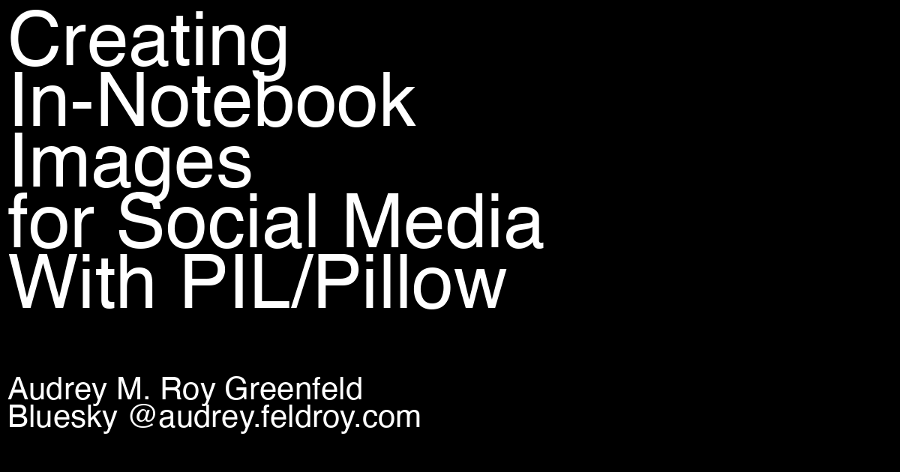

# Creating In-Notebook Images for Social Media With PIL/Pillow

Here I use the Python Imaging Library to create and display an image in-notebook, so that it's rendered as part of the blog post on audrey.feldroy.com.


```python
from PIL import Image, ImageDraw, ImageFont
```

## What Size?

I read that 16:9 images are good for social media. Is that really true? I prompted a few LLMs with:
        
> What is the optimal blog post image size in pixels so it looks good on Twitter, LinkedIn, and Bluesky when posted there?

* Claude 3.5 Sonnet says 1200 x 630
* DeepThink R1 says 1200 x 630
* DeepSeek V3 says 1200 x 628
* ChatGPT o1 says 1200 × 675
* ChatGPT o1-mini says 1200 x 627
* ChatGPT 4o says 1200 x 628

That's quite a lot of variation! I think I'll go with:


```python
w,h = 1200,630
```

## Create an Image With PIL


```python
img = Image.new('RGB', (w, h), color='black')
draw = ImageDraw.Draw(img)
title = "Creating\nIn-Notebook\nImages\nfor Social Media\nWith PIL/Pillow"
author = "Audrey M. Roy Greenfeld\nBluesky @audrey.feldroy.com"
draw.multiline_text((10, 10), title, font=ImageFont.truetype("Helvetica", 100), fill='white')
draw.multiline_text((10, 500), author, font=ImageFont.truetype("Helvetica", 42), fill='white')
img
```


    

    


## It's Base64-Encoded

I noticed that when I posted this link on Bluesky, the image preview didn't show up: https://bsky.app/profile/audrey.feldroy.com/post/3lgjm2nzflc2f

When I inspect the image element, I see:

> ``

That means my little hack won't work for putting social-media previewable images onto my notebooks.

I'll have to save an image file next time I try this.

## Side Notes

I found this old [Twitter: Upcoming changes to PNG image support](https://devcommunity.x.com/t/upcoming-changes-to-png-image-support/118695)

> For images that are low resolution but require maintaining a high quality, the test for PNG images will add the following change: If the image is a PNG that is 900 pixels or smaller in the longest dimension (can fit into 900x900), that PNG will be left as-is.
