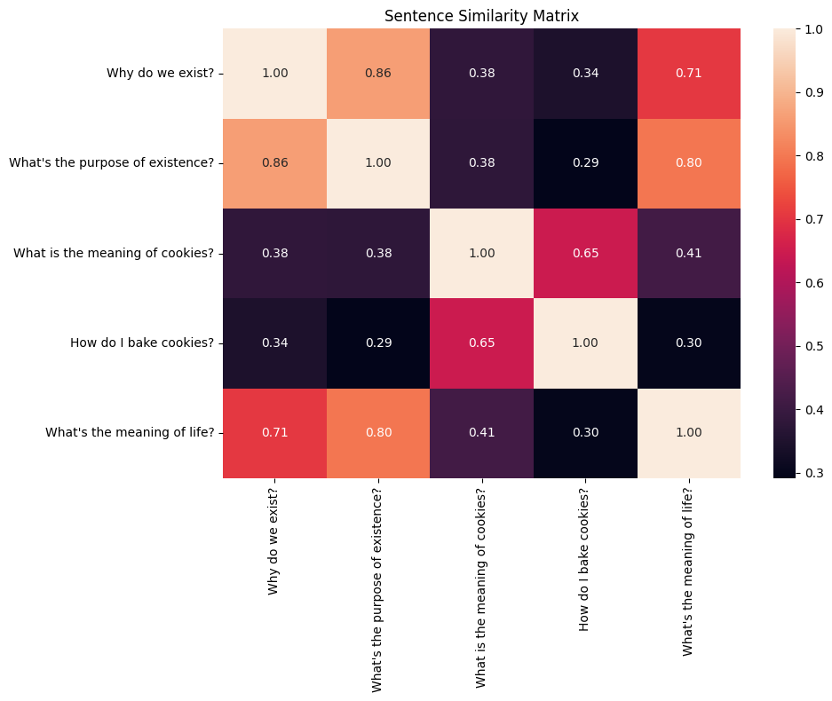

# Text Embeddings and Cosine Similarity

I use Gemini's text-embedding-004 model to generate embeddings for sentences. Then I define a cosine similarity function and see what it returns for a few related and unrelated sentences.

## Setup


```python
from fastcore.utils import *
import google.generativeai as genai
import matplotlib.pyplot as plt
import numpy as np
import os
import seaborn as sns
```


```python
genai.configure(api_key=os.getenv('GEMINI_API_KEY'))
```

## Generating an Embedding


```python
result = genai.embed_content(model="models/text-embedding-004", content="What is the meaning of life?")
```


```python
str(result)[:100]
```


    "{'embedding': [-0.010632273, 0.019375853, 0.020965198, 0.0007706437, -0.061464068, 0.014739741, -0.0"


```python
e = L(result['embedding'])
e
```


    (#768) [-0.010632273,0.019375853,0.020965198,0.0007706437,-0.061464068,0.014739741,-0.0022759985,0.013184195,0.014464715,0.022593116,0.02184836,-0.059616957,0.06032222,-0.047657482,0.017848385,-0.10987464,-0.0598155,-0.00479664,-0.043298274,-0.05090505...]


## Generate More Embeddings


```python
sentences = [
    "Why do we exist?",
    "What's the purpose of existence?",
    "What is the meaning of cookies?",
    "How do I bake cookies?",
    "What's the meaning of life?"
]
```

Get an embedding for each sentence:


```python
def embed(s): return genai.embed_content("models/text-embedding-004", s)
ems = L(sentences).map(embed)
ems
```


    (#5) [{'embedding': [0.019559344, 0.019688405, -0.038842924, 0.012698846, -0.035833146, 0.028341196, 0.052558787, -0.019968225, -0.010917543, 0.03131587, -0.017641881, -0.011561374, 0.06553263, -0.033051796, -0.005336117, -0.07849998, -0.05368801, -0.029812962, -0.0692188, -0.008345575, 0.047584742, -0.03687471, 0.039014176, -0.033440135, 0.002978692, 0.042214964, 0.036658864, 0.045153357, -0.0041409903, -0.05310909, 0.013112881, 0.0066154776, 0.013813996, -0.034904897, 0.008139633, -0.017468236, -0.030165534, 0.05193462, 0.04006202, -0.013289335, -0.04039274, 0.009033101, -0.0142124, -0.0248393, 0.020853698, 0.021040585, 0.054452818, -0.025659267, 0.013948726, 0.07748278, 0.03256458, 0.016619649, -0.059931885, -0.01200441, -0.004653669, -0.017855817, -0.03539421, -0.023281118, 0.026218886, -0.023804223, -0.022577595, 0.008715175, -0.04725901, -0.03219246, -0.035418466, 0.08307132, -0.023135524, -0.0073083555, -0.020209154, 0.04700945, -0.023403414, 0.053417407, -0.020986862, 0.004860277, -0.026985686, 0.023137974, -0.014628486, 0.00886644, 0.008816194, 0.019912679, -0.034764588, -0.005426867, 0.09643434, 0.0949265, 0.03787525, -0.019451771, -0.013641013, -0.018325862, -0.03828355, 0.012069418, 0.057003804, 0.0093015265, 0.0059600347, 0.021149585, 0.03133173, 0.03720914, -0.042200685, -0.01643755, 0.055456888, 0.03369158, 0.005826883, 0.014425398, 0.0019331928, -0.055760194, 0.05363726, 0.028239496, 0.020834569, -0.026823854, -0.0023878946, -0.035598416, 0.019247413, -0.048998047, 0.061250925, -0.014620846, 0.00562841, -0.05411676, -0.010234606, 0.049415663, 0.0068903784, 0.02290544, 0.010027162, 0.03347583, -0.0669641, 0.026025185, 0.040415116, 0.02575924, 0.017584624, -0.04320471, -0.05825505, 0.03926349, -0.0077897655, -0.045604426, -0.0072398726, 0.05329192, -0.043230563, 0.0022445049, 0.073956676, -0.046547562, 0.014641774, -0.08863603, 0.05591301, -0.0062542264, 0.015305073, 0.011936939, 0.0042881295, 0.0027001428, 0.0048576957, -0.031032823, -0.009511515, -0.016183808, 0.029264407, 0.029971713, 0.06654776, 0.006730142, 0.010888367, -0.07324675, 0.036305368, -0.0041233934, 0.06932873, -0.06716617, 0.052331917, -0.026681794, -0.08032771, -0.022472354, -0.05089448, -0.079026446, 0.013899382, -0.024549138, 0.0040511442, 0.003860759, 0.0038891118, -0.039236903, -0.015453001, -0.08957148, -0.009402, 0.022528736, -0.03179946, -0.08257331, 0.03828568, -0.004052506, 0.03898724, 0.018845124, -0.06805098, -0.044468503, -0.013145666, -0.040522773, -0.0077103586, 0.057688385, 0.08610383, 0.018432783, -0.019139964, 0.023435883, -0.0018954696, -0.04198888, -0.03414694, -0.02466722, 0.05019371, -0.0048587536, 0.013163664, 0.0367594, 0.007836788, -0.0223404, -0.004893806, -0.0023127727, -0.0065204473, 0.014853633, -0.029524624, -0.016012063, 0.012315839, -0.008397751, -0.02425756, 0.010814258, 0.0012457075, -0.052492566, 0.01342834, 0.01732293, 0.08642585, 0.008832287, 0.11771176, 0.0011916885, -0.02142505, 0.017426927, 0.04563702, -0.015801065, -0.004412682, 0.0026467296, -0.0127852475, -0.042396303, -0.038978964, -0.010424323, 0.032874014, -0.009103222, -0.030879144, 0.0007931969, -0.06994995, -0.027662592, 0.022217479, 0.02276498, 0.04125933, -0.01996121, 0.021089641, -0.07215084, 0.023322267, -0.0103097, 0.008607427, 0.025970375, 0.035199195, 0.070990354, 0.031110903, -0.106757954, -0.057319637, -0.01793105, -0.0068492224, -0.06022143, -0.055420827, -0.09284712, 0.011251366, -0.027523892, 0.009087255, -0.003742624, 0.03380523, -0.08084819, -0.016592847, -0.05686363, -0.03411884, -0.019969236, -0.020863911, 0.009645333, 0.018662103, -0.022727976, 0.017568642, 0.02353722, -0.005343433, -0.028650217, 0.020965874, 0.019500583, 0.008538201, 0.054331873, -0.013331355, -0.036086276, 0.051704727, -0.020936597, 0.012712174, -0.04390921, 0.014506246, -0.032840338, -0.003707577, 0.020655561, -0.029050598, -0.021539295, 0.010403525, 0.00837272, -0.013414598, -0.024430726, -0.01512924, 0.01892647, 0.053300288, 0.02370144, 0.03895795, 0.016967664, -0.015338753, 0.07106665, -0.039107695, -0.003011071, -0.020632869, -0.0035278718, 0.012108964, -0.0041421913, -0.04045343, -0.023367474, -0.016931225, 0.0009534359, 0.0037057698, 0.04803794, -0.01734055, -0.024234368, -0.08907127, -0.042959444, -0.021588717, 0.034053583, -0.018208396, 0.037968762, -0.01368824, 0.016938932, 0.03989809, 0.036169793, 0.02500163, 0.022300709, -0.0050846008, -0.03473683, 0.005580522, -0.003193937, -0.0036682868, 0.0059282356, -0.025699131, 0.03994741, -0.05797224, 0.0028945988, 0.017657805, 0.10819321, 0.009672927, -0.024333563, 0.026133303, 0.03886509, -0.007592681, -0.013555792, -0.0014022413, 0.0013311146, -0.032451626, -0.050381355, -9.3926385e-05, 0.033313647, 0.05527058, -0.06536724, -0.050012637, -0.006010137, 0.01675024, 0.020516198, 0.013128006, 0.024345655, -0.024193337, -0.02737058, 0.019892095, 0.005008491, 0.008333471, -0.0007417835, 0.009282026, 0.065808296, 0.05807617, -0.07465, 0.036518812, 0.0044759386, 0.012650994, -0.010828705, 0.00498354, 0.025709987, -0.042535037, -0.0024358425, 0.06283702, -0.08498964, -0.021577943, -0.031856414, -0.03478517, -0.01909301, -0.034373127, 0.054004487, -0.006421617, -0.008395878, 0.010553766, 0.07340329, -0.036035426, 0.034811307, 0.03187329, 0.027198492, -0.048721157, 0.00018118306, -0.025360014, 0.033149805, -0.0071570985, -0.011584375, 0.010392878, -0.00984536, 0.084506646, -0.006048445, -0.017471747, -0.034110498, 0.066509336, -0.0065114596, 0.038680967, -0.03525334, -0.02426362, 0.005776328, 0.042461198, -0.015889812, -0.047400806, 0.00029323783, 0.0113588665, 0.012234194, 0.030907117, 0.037586503, 0.02442776, -0.01504803, 0.06628163, -0.055509575, 0.031484414, -0.05679345, 0.016586594, -0.0028617159, 0.020243907, 0.055357907, 0.033271685, 0.031748127, -0.030662227, -0.023106394, 0.00067453424, -0.0037569301, -0.045469254, 0.0072608707, -0.0004780202, 0.038369328, -0.035722807, -0.01087675, 0.03626572, 0.013732935, 0.021060765, 0.011381702, 0.05324622, -0.026974797, -0.008955662, -0.02043923, -0.0011922217, -0.0015759727, 0.017586602, -0.010087369, -0.009513751, 0.038635124, -0.008908999, 0.02084363, 0.0054036654, 0.016964732, 0.01521214, -0.016514545, 0.12769827, -0.010629863, 0.031953968, -0.03388331, 0.0065201353, -0.021272497, 0.010526078, 0.06791755, 0.010520596, -0.014393185, 0.03786847, 0.0013276851, 0.017755022, -0.0051197396, 0.029321972, -0.029903904, 0.06097156, -0.0051813116, 0.009707199, 0.009609702, -0.014653337, 0.093088254, 0.039452564, 0.0019468423, -0.014434867, -0.017652305, 0.030399023, -0.0005857439, 0.01615256, 0.049189266, 0.028816672, -0.03310669, -0.029076535, -0.04187652, -0.018944899, 0.007225352, 0.02642436, -0.0016279723, 0.037544355, 0.011305566, 0.0011004792, 0.027661834, -0.014117753, -0.030421738, -0.007666907, -0.014011926, 0.036239587, -0.010537589, -0.005677156, 0.023365745, 0.04501208, 0.01478136, -0.03472927, 0.004363857, 0.0269561, 0.036608733, -0.028986553, 0.10786093, -0.027419379, -0.053928804, 0.0688668, -0.018858455, -0.026215464, 0.0041304305, -0.018775638, -0.011924428, 0.022407804, 0.0327174, -0.020332148, 0.0430572, 0.043091513, 0.013098264, -0.056578495, 0.051466852, 0.03627859, 0.007513433, -0.033982236, 0.043275576, 0.031428155, -0.011556944, 0.042565376, 0.06429553, -0.013366108, 0.0010405376, 0.034561798, 0.04354288, 0.00032236442, 0.028911415, 0.054391604, -0.045613814, 0.02584321, 0.0070898575, 0.007055355, -0.016818926, 0.051679064, 0.04824722, -0.020098463, -0.019463897, 0.038276512, -0.032185633, 0.0771882, -0.006860061, -0.008851787, 0.053279437, -0.005726036, -0.0010540055, 0.007164483, -0.040483266, 0.06723213, -0.016529197, -0.0061404933, 0.0053522247, 0.023905132, 0.023935363, -0.05152935, 0.010651252, -0.029364288, -0.024255263, 0.04808745, 0.019950999, 0.044445775, 0.05268386, 0.025885379, 0.023042422, 0.02378541, 0.0049945815, -0.039691754, 0.00176018, 0.009061611, -0.0033555469, 0.00029126872, -0.0017431849, -0.019394463, -0.050402302, -0.021630285, -0.012927581, 0.040268034, 0.014435134, -0.043120265, 0.015031705, 0.04226494, -0.07026235, 0.011190856, 0.02559949, 0.026165782, 0.026111202, 0.012512601, -0.0495821, -0.019706834, 0.027782824, -0.030951787, -0.017615192, -0.04928905, -0.033762947, -0.026877385, 0.0024974162, 0.036794588, -0.04116042, 0.029049195, 0.0039221635, 0.020268673, 0.012372338, -0.087358, 0.0521495, 0.034844454, -0.025055911, -0.07853792, 0.019399136, -0.091009416, 0.023053171, 0.034513913, -0.024689386, -0.050725527, 0.04869214, -0.0316221, 0.017922074, 0.0013126489, -0.0031334774, -0.010004514, 0.05051277, 0.0004334298, 0.09120775, -0.03453433, 0.03252854, -0.026565868, -0.025150564, 0.047268137, 0.044376787, -0.003233609, 0.005863764, 0.056103863, -0.009704634, -0.006837661, 0.01962975, -0.026316356, -0.007809235, -0.006238235, -0.063504964, 0.048806675, -0.036507584, -0.054270398, -0.03677777, 0.036112174, -0.03584262, 0.02275349, 0.011271967, -0.022053061, -0.040151473, -0.01787115, 0.009288113, 0.030723311, -0.020268269, 0.02882673, 0.018371724, 0.03814555, -0.020186651, 0.004244633, -0.032509625, -0.027605062, -0.048723064, -0.0013323132, -0.0028026826, -0.032226223, 0.010561235, 0.019623881, -0.022545654, 0.03366687, -0.012321469, -0.047856387, -0.018377826, -0.039163142, -0.048608206, -0.032090236, 0.0636791, -0.052944332, 0.070429765, -0.025336295, -0.008365867, -0.019418588, -0.0124758445, -0.030211503, -0.017315594, 0.017375901, 0.0016082232, 0.026490644, -0.011170542, -0.05893974, 0.04563805, -0.07601582, 0.035570942, 0.08122305, 0.028558189, -0.018510731, -0.014165663, 0.026953185, -0.011220896, 0.037700877, -0.05016822, -0.044733185, -0.05861239, 0.029085893, 0.028266577, 0.012970051, -0.055997044, -0.05661104, -0.01548366, -0.013075292, 0.025619756, 0.0529151, 0.0242807, -0.032903876, -0.0063735973, 0.016841061, 0.019519126, -0.0012519737, -0.014137339, 0.042171083, -0.03740882, 0.019830808, -0.012798625, 0.078776695, -0.062634, -0.043290466, -0.009578936, -0.03378326, -0.032633215, -0.026321068, -0.023266984, -0.10082919, -0.03798227, 0.0068702684, 0.060559276, 0.011526987, -0.08035362, 0.010471254, -0.0518781, 0.05918788, 0.04698825, -0.014969117, 0.056565844, -0.0070444196, 0.033456646, -0.048153937, -0.02608274, -0.033295162, -0.04866493]},{'embedding': [0.0055299145, 0.015976083, -0.03252863, 0.0085338475, -0.04153219, 0.019912213, 0.052301887, -0.023040043, -0.0113499, 0.007877065, 0.00027295845, -0.041056458, 0.04185036, -0.040913787, -0.0005181403, -0.107098415, -0.038616266, -0.017643774, -0.041365415, -0.02451075, 0.034770284, -0.005237407, 0.026521789, -0.039716255, 0.020663282, 0.074208744, 0.03740934, 0.057818986, 0.0010548941, -0.01334914, 0.021355726, 0.004827338, 0.0061436407, -0.020185879, 0.03756921, -0.002902677, -0.010755764, 0.030986143, 0.05103259, 0.0016618514, -0.049849723, 0.030844528, -0.04369407, -0.015652288, 0.00048789656, -0.014619853, 0.0068280064, -0.026258288, -0.016992258, 0.08384266, 0.05941157, -0.0043564443, -0.05592138, 0.021560943, -0.002709731, -0.024369676, -0.0700631, -0.017366167, 0.014321517, -0.03413158, -0.014013205, 0.01787672, -0.050234083, -0.018810268, -0.04975639, 0.0577216, -0.04051553, 0.015903115, -0.027970651, 0.056759845, -0.026855022, 0.06408677, -0.030957269, 0.009332663, -0.042445153, 0.044731174, -0.0051541785, 0.017343, 0.011137876, 0.0070290836, -0.02368582, 0.018451348, 0.073816195, 0.05797947, 0.051947985, 0.0035444906, -0.011047631, -0.047306523, -0.042118505, 0.041445322, 0.027870327, 0.0047604325, -0.01949014, 0.019256834, 0.027842646, 0.017089104, -0.037537884, -0.0055100275, 0.04908459, 0.036795657, 0.0018900051, 0.029737731, -0.0008043652, -0.056646045, 0.05498234, 0.024982104, 0.033666264, -0.021151232, 0.018519633, -0.018493162, 0.027396934, -0.041756626, 0.03438909, -0.042874593, -0.033361975, -0.03407447, -0.008385384, 0.03912268, 0.03925133, 0.011603657, 0.018850313, 0.028039265, -0.04363995, 0.0054140347, 0.049572524, 0.0327373, 0.04777856, -0.047864348, -0.038150106, 0.025863014, 0.035790432, -0.051972646, -0.027535548, 0.062790655, -0.006538611, 0.062499337, 0.12059177, -0.056610707, 0.01992029, -0.10145069, 0.046710037, 0.01459962, 0.035405498, 0.039951254, 0.050793484, -0.016367326, 0.06914353, -0.031521052, -0.005887455, -0.008187189, -0.0045084576, 0.03180967, 0.06891912, -0.013179503, 0.007690642, -0.059313558, 0.05707232, -0.0019135665, 0.04370991, -0.05847243, 0.013450072, -0.031342894, -0.08945743, -0.0465823, -0.03719383, -0.033561874, 0.038017426, -0.050257396, -0.034150295, 0.008641591, 0.0013443745, -0.0038792375, -0.031400934, -0.06427662, -0.018081876, 0.037875153, -0.028627962, -0.07252736, 0.025676353, 0.010599173, 0.02814546, 0.039867993, -0.055281688, -0.04584882, -0.014634026, -0.023378765, -0.0060328003, 0.06294591, 0.06681563, 0.0235838, -0.025250461, 0.03342145, -0.023153502, -0.023933195, -0.027909841, -0.022926707, 0.0642535, 0.010180235, 0.035040405, 0.04047129, 0.02089372, -0.030772328, -0.0063262694, -0.012199179, 0.01594476, 0.027957797, -0.03443476, -0.036461677, 0.007274325, -0.029590495, -0.047986045, 0.012396383, -0.020216655, -0.07308198, 0.026717115, 0.020936992, 0.09110298, 0.0024449283, 0.09235799, -0.024094073, -0.024761507, 0.008288822, 0.036189422, -0.02013013, -0.03529398, -0.00018906535, -0.017311156, -0.031964783, -0.053017333, -0.012811646, 0.021451691, 0.0032090414, -0.010985314, 0.032838814, -0.05782762, -0.02165869, 0.022742165, 0.048517033, 0.017417962, -0.04033304, 0.035317678, -0.009841827, 0.017625906, -0.021649547, 0.06705517, 0.024610555, 0.023330308, 0.06557631, 0.018015038, -0.1107075, -0.06298185, 0.0004348765, 0.00575298, -0.04391643, -0.05085776, -0.06197453, 0.012120155, 0.01559635, -0.016296137, -0.01343289, 0.017793737, -0.075396225, -0.029964361, -0.038764365, -0.017215066, -0.027644329, 0.003494582, -0.00093482033, 0.041965637, -0.05349281, 0.033863615, 0.032483872, -0.023491459, -0.002359247, 0.03413903, 0.022327378, 0.026350155, 0.054314416, -0.02907779, -0.06448874, 0.046630457, -0.044114202, 0.0056628706, -0.03450759, 0.020371577, -0.057966456, 0.023190042, 0.009229684, -0.030840551, -0.012547657, 0.019463254, 0.029675502, -0.0163683, -0.025778476, -0.008029987, 0.04053629, 0.03105792, 0.0037108567, 0.037711065, 0.016617155, 0.008958086, 0.07527922, -0.07479552, -0.0061737695, -0.022897407, 0.0025745586, 0.03077111, 0.0004831056, -0.02745648, -0.0036424585, -0.014906562, -0.0035166054, -0.019008297, 0.06711564, -0.04721153, -0.050511897, -0.1045961, -0.047167793, -0.013348051, 0.026999336, -0.026396398, 0.03750437, 0.006470651, 0.035291664, 0.08244763, 0.02417339, -0.00049562636, 0.02496533, -0.015604459, -0.024557162, -0.0065040784, -0.034903508, -0.0010501123, 0.013483476, 0.020725392, 0.03952534, -0.040239777, -0.03499967, 0.0359498, 0.08322509, 0.0063502896, -0.03774375, 0.0005459914, 0.041945204, -0.0026405877, -0.0074812435, -0.029901773, -0.027724516, -0.014019214, -0.040111493, 0.0047925455, 0.044931903, 0.052499533, -0.044434644, -0.02802719, 0.00080376945, 0.037977356, 0.016541246, -0.008617853, 0.028651927, 0.0048873504, -0.032863475, 0.019912904, -0.01479895, 0.017238764, -0.011724358, -0.0050157723, 0.06307567, 0.051124204, -0.0636719, 0.02708637, 0.007955014, 0.00010896572, 0.0020504165, -0.025316713, 0.022276344, -0.025709031, 0.008376572, 0.009555922, -0.085886985, -0.0259328, -0.049509566, -0.044508215, 0.011967926, -0.022240937, 0.033781607, -0.018016716, 0.012951104, 0.011191756, 0.046933748, -0.045379497, 0.042194016, 0.008615857, 0.010030198, -0.05255967, 0.0066947592, -0.007497884, 0.01196649, -0.026863862, 0.0260683, 0.01654939, -0.01598151, 0.102992475, -0.025985217, -0.0045826, -0.021143548, 0.08420831, 0.023635257, 0.027399471, -0.08504566, -0.019169785, 0.00037822552, 0.0438965, -0.019417142, -0.049135216, -0.044555474, -0.0057454123, 0.024084369, 0.020318322, 0.041476827, 0.01685162, -0.0245661, 0.086617626, -0.04114976, 0.009701192, -0.07254203, 0.018528521, -0.019225165, -0.004415693, 0.071347244, 0.06241357, 0.03352658, -0.0090604415, -0.05234913, 0.01207469, 0.011266438, -0.019906588, 0.025756724, -0.027807975, 0.015727695, -0.03197756, -0.005602613, 0.06091111, -0.0091656195, 0.02445135, -0.0032175002, 0.0591271, -0.07310107, -0.011912357, -0.021539615, 0.011339614, 0.049366336, -0.0011728038, -0.024688058, -0.0293873, 0.026216807, -0.04005543, 0.013712135, -0.00091013144, 0.0111895455, 0.015410849, -0.014241178, 0.10678434, -0.021419654, 0.018615741, -0.011024726, 0.011007858, -0.002535974, -0.00068300555, 0.0696292, 0.018558828, 0.009954603, 0.04934536, -0.006564521, 0.016871007, 0.01134582, 0.064464435, -0.06583986, 0.019978218, -0.018039972, 0.014246711, 0.04407318, -0.022559995, 0.07596248, 0.022549262, 0.0016918607, -0.01434493, 0.009379454, 0.0330141, -0.017992597, 0.029071338, 0.02708471, 0.018706016, -0.040706135, -0.0067928014, -0.027816018, -0.0061244755, 0.019533016, 0.05352348, 0.010267779, 0.048359677, 0.017944835, 0.01652811, 0.03362375, -0.025331162, -0.035222333, -0.016505344, -0.01642365, 0.046471182, -0.016766615, 0.008091419, 0.029640786, 0.036549505, 0.0036465528, -0.008503627, 0.0077637024, 0.013146597, 0.03600726, -0.015579438, 0.12360897, -0.0008739744, -0.04170959, 0.04723421, -0.005640671, -0.0023533204, 0.027421996, -0.0065621883, -0.0068025584, 0.0332058, 0.019262265, -0.020278705, 0.050736636, 0.035770677, 0.015072083, -0.015239555, 0.062699206, 0.03903619, 0.010240108, -0.009638468, 0.023097316, 0.029076427, -0.03585415, 0.028886272, 0.034848787, -0.030523434, -0.03605965, 0.009684965, 0.05868433, -0.0134171685, 0.057202138, 0.03962618, -0.010182715, -0.0015616404, -0.0062294677, 0.010087473, -0.017558984, 0.055085175, 0.041392133, -0.03666675, 0.02494935, -0.015005541, -0.02203859, 0.059715133, 0.0039245132, -0.014024913, 0.03968987, -0.024612295, 0.006715272, 0.023869716, -0.023937652, 0.061185315, -0.03315896, -0.030969225, -0.013478363, 0.014423611, 0.029968942, -0.046801075, 0.021466132, -0.0539161, -0.03439243, 0.03388231, 0.0021620297, 0.06416999, 0.025416665, 0.015804179, -0.010292441, 0.015018533, -0.0072216266, -0.0025402184, 0.009462607, -0.003911199, 0.057183977, 0.011900363, -0.022966893, -0.002829548, -0.023066318, -0.012252259, -0.023549516, 0.012816578, -0.003429983, -0.039040003, 0.02121401, 0.06404795, -0.037277628, 0.009294208, -0.01394835, 0.030534884, 0.009323603, -0.0004839005, -0.06999754, -0.022930559, 0.06607066, -0.049240477, 0.01812483, -0.056814928, 0.024433907, -0.014508902, -0.0063334834, 0.01637204, -0.023253454, -0.00044496037, -0.008115152, 0.04887477, -0.018764643, -0.06938674, 0.024646956, 0.01665943, -0.029058667, -0.037684027, 0.015048932, -0.08578976, 0.010736382, 0.032698907, -0.018852094, -0.03902195, 0.04051618, -0.031569608, 0.029360896, 0.025371024, 0.018268224, -0.004655463, 0.04118569, 0.019847479, 0.040453084, -0.04176548, 0.05232552, -0.023073781, -0.016684098, 0.024354316, 0.059018336, -0.010141303, -0.002937273, 0.03304782, 0.003885282, -0.016802212, 0.019974576, -0.027988045, -0.039659444, -0.026398808, -0.07142992, 0.042269647, -0.03551978, -0.03981407, -0.006630655, 0.026573595, -0.035146058, 0.050573472, 0.027234606, -0.019879451, -0.028782524, 0.017020034, 0.053154044, 0.012085234, -0.0044045006, -0.0067319255, 0.028778749, 0.026122397, -0.0059374087, 0.024008814, -0.020906972, -0.027585369, -0.044894222, 0.0058991103, -0.016917542, -0.03745272, 0.0145768095, 0.036559843, -0.01641961, 0.024029553, -0.027688675, -0.03399164, -0.008091832, -0.028874522, -0.017343033, -0.0011762386, 0.07028104, -0.0065218587, 0.046216678, -0.015607567, -0.014075314, -0.016925745, 0.0033577252, -0.041351557, -0.0017065749, 0.04641156, -0.004087644, 0.025686366, -0.009248746, -0.06987654, 0.022668112, -0.019273065, 0.03289836, 0.06982686, 0.0033003718, -0.024898486, 0.010820118, 0.0030670455, 0.0011940318, 0.03719871, -0.039897863, -0.033462796, -0.069646604, 0.012850349, 0.016927302, 0.031218823, -0.038780026, -0.05186924, 0.0031056956, -0.021460904, 0.014945444, 0.062719174, 0.044231385, -0.031367145, 0.020837134, -0.0002945861, 0.01178464, 0.025025135, 0.005778622, 0.06383246, -0.037612878, 0.008952058, 0.001994262, 0.036255118, -0.06739668, -0.014048205, 0.0028677857, -0.043530215, -0.026524862, 0.0022974918, -0.015162735, -0.075119056, -0.028096385, 0.025931295, 0.08692148, 0.02831577, -0.07243474, -0.011306747, -0.017206656, 0.07495275, 0.040830676, -0.024579044, 0.05917555, -0.01315165, 0.005830013, -0.07218274, 0.0038066823, -0.028578354, -0.052044146]},{'embedding': [-0.013367988, 0.021623494, 0.019893773, -0.024848739, -0.017675169, -0.021177836, 0.016302193, -0.039095752, -0.030949285, 0.07275306, 0.043748636, -0.0010294794, -0.021978177, -0.05670143, -0.023598792, -0.04642435, -0.015440941, -0.004734323, -0.028929666, -0.048929088, -0.009121483, -0.043350898, -0.01168912, -0.06301231, -0.097033076, 0.025917448, 0.04714473, -0.07291371, 0.058355715, 0.004610292, 0.062400084, 0.048386764, 0.026240973, -0.04028202, -0.011407082, -0.02760905, -0.04034321, 0.00040013797, 0.084724, -0.06047052, -0.071828805, -0.035297655, -0.051576234, 0.0010817025, -0.04586386, 0.0073687444, 0.03509793, 0.06795091, 0.013897329, 0.011974175, 0.049476206, -0.04791594, 0.039229166, 0.05238942, -0.007700092, -0.13159719, 0.013447709, -0.027612327, -0.0037572344, -0.0046500955, -0.015975023, -0.025222864, -0.042841874, -0.037864264, -0.021537919, 0.020273376, -0.033534065, -0.048033427, -0.08552713, 0.014019746, -0.03841419, 0.07150533, 0.006800049, -0.015055074, 0.016081974, -0.007754596, 0.019018093, 0.011572801, 0.024351284, 0.047334924, -0.05684119, 0.018945497, 0.036306072, 0.040070917, 0.012823003, -0.00082612666, 0.0018670722, -0.025328271, -0.06922146, 0.057475965, 0.0036180976, 0.016829062, -0.029524636, 0.027568156, 0.020935865, -0.045086768, -0.05678989, -0.023004089, 0.09452473, 0.057929292, 0.017045835, -0.018527586, 0.005743674, -0.018333616, 0.06148821, 0.059371218, 0.03603623, -0.026704608, -0.026318613, -0.05245237, 0.016066575, -0.012165781, 0.04107052, 0.0071074893, 0.037864022, -0.0048338147, -0.027536767, 0.04505462, -0.030705608, -0.045801554, 0.04868687, -0.023453843, -0.0206883, 0.0012601871, 0.03535943, -0.04466528, -0.013787456, -0.04995875, 0.017728329, -0.0045554773, 0.0339853, -0.07259698, 0.021818634, 0.04751598, 0.0028396074, 0.0115930475, 0.03922263, 0.029207325, -0.015811637, 0.04978435, -0.016762922, -0.010246296, -0.071263775, 0.036960654, 0.0035373105, -0.015463055, -0.022539567, 0.05173709, -0.012422792, 0.048400536, -0.020384384, 0.009962306, 0.064682215, 0.010956388, 0.00092752, 0.04202661, 0.03918927, -0.0039895256, 0.02398445, -0.016538434, 0.014667983, -0.011839151, -0.038694303, -0.037813816, -0.050842248, -0.021964898, -0.041639645, -0.03343663, -0.00065739016, 0.023276687, -0.029620133, -0.0077933725, -0.041256256, -0.044307753, -0.014003777, -0.0507389, -0.018984174, 0.005821486, -0.011959146, -0.021005973, 0.066633455, -0.015030751, 0.009922968, -0.025449447, -0.0069937925, -0.008504127, -0.015556411, 0.020964233, 0.011401062, -0.0047036135, -0.012994281, -0.0061225733, -0.0020085734, -0.0075166295, -0.009369939, 0.023237303, -0.009254933, -0.025649121, 0.035248656, 0.004540912, 0.027657421, -0.012210955, 0.0039031098, -0.013782701, -0.05439562, 0.037921138, -0.0016010077, 0.059418168, 0.06580409, -0.027809624, 0.038827837, -0.031305213, -0.032230943, 0.030211128, 0.0631487, 0.037921358, 0.042659245, 0.013118398, 0.05467954, -0.010808727, 0.008111051, 0.0120553905, 0.008274038, 0.0053525344, -0.028039632, 0.01789012, -0.055253778, -0.044315837, -0.016321111, -0.052109018, 0.004013322, 0.045870565, -0.032700665, -0.0333926, -0.018112276, 0.02209445, 0.022871155, -0.006775308, -0.011195738, 0.0068796505, 0.016160842, -0.02245653, -0.0013247328, -0.014204797, 0.0045121126, 0.034330525, 0.0367716, 0.030903261, 0.007854997, -0.102000825, 0.010465969, -0.014847536, -0.01578828, -0.02847807, -0.02874307, -0.030250674, 0.050553504, -0.10352312, -0.029383078, 0.048817337, 0.033108782, -0.00737229, -0.03606708, -0.056335416, -0.018612891, -0.04229483, -0.047087096, -0.036168523, 0.021109268, -0.055884592, 0.042523883, 0.0051122475, -0.011455388, 0.0025326968, -0.011264692, 0.0039169574, -0.02429472, 0.0055609434, 0.011571544, -0.013803845, -0.036758572, -0.003906351, 0.0032258567, 0.019053495, 0.0086946925, -0.07650003, 0.027830785, 0.0258893, -0.023594577, -0.0056195804, 0.019188669, 0.017413354, 0.008569565, -0.0453116, 0.010885835, 0.019774504, 0.09298858, -0.016214997, -0.05794665, -0.03175085, 0.029260457, 0.034088876, -0.051291533, -0.009329054, 0.03295409, -0.0009902227, 0.03533103, -0.04932189, 0.0309901, 0.046222024, -0.06416138, 0.06425204, -0.043453567, -0.046200074, -0.058674026, 0.0046375575, -0.09400862, -0.019530393, -0.04010062, 0.0331711, 0.07776503, 0.02568413, 0.040060554, 0.007126377, -0.0059552197, 0.013877838, -0.02019597, -0.009501586, -0.023716355, 0.038902134, 0.0069121816, 0.02133539, -0.05432855, -0.07003436, 0.030525941, 0.017943956, -0.03431744, 0.017118096, 0.0007421564, 0.031053724, -0.028948946, 0.008195673, 0.043847226, 0.017962625, -0.037056614, -0.050870825, -0.018612077, 0.014487195, -0.037260026, -0.025010252, 0.0001461193, 0.06156573, 0.008275483, 0.0094837835, 0.013876921, 0.032117497, 0.018105332, -0.017374871, -0.017488714, 0.018126596, 0.037308794, -0.02232745, 0.006362914, 0.05697592, 0.032996833, 0.0004186987, 0.031107431, 0.04040763, -0.0001609017, 0.02312686, -0.01304702, -0.0034463764, -0.033495042, 0.0025122962, 0.03549306, -0.035413764, -0.018825097, 0.012207431, -0.015327017, -0.049409505, -0.058265578, -0.067442246, -0.015345004, -0.009465938, -0.042133633, 0.0554657, -0.048541605, 0.016356539, 0.05999714, 0.022402616, -0.019361848, 0.009357605, -0.022483476, 0.06743397, -0.006667082, 0.038891956, -0.011519378, -0.059854798, -0.04216744, -0.005224496, 0.027289353, 0.008744135, 0.041044198, -0.023279255, -0.015846018, -0.02160166, 0.08406244, 0.017207613, -0.024915349, -0.027251879, 0.024013542, -0.08066741, -0.03022033, 0.04718762, -0.026560586, -0.02378763, -0.0231223, 0.029231064, -0.0083156405, 0.048179276, -0.048385285, 0.0036213484, 0.02214594, -0.02727365, 0.020983096, -0.039072674, -0.017642314, -0.01781586, -0.03117055, 0.03564157, -0.010177732, 0.016842188, -0.006989856, 0.0052934024, -0.03425812, -0.015846407, -0.007355636, 0.03939038, -0.043918032, 0.03707798, -0.015279948, 0.0045641796, 0.048826464, -0.014140232, -0.010927639, 0.06607664, 0.011056202, -0.016409473, -0.0016775138, -0.03934618, -0.056494948, -0.027674291, 0.033455443, -0.012421703, -0.014835141, -0.019508015, 0.054388672, 0.016416105, -0.039732497, 0.076855876, 0.0014250891, -0.051467303, 0.11113907, 0.008200216, 0.041486938, -0.010050465, -0.024478778, 0.04064621, -0.056196246, 0.009630992, -0.027049953, -0.013607437, -0.04165013, 0.037047267, 0.016490968, 0.0017615746, 0.023429548, -0.00043448107, -0.01194205, -0.03361089, 0.004705298, -0.044466693, -0.0058627715, 0.0054537305, 0.04772569, -0.012897695, 0.0487586, 0.023164192, -0.011466161, -0.029130658, -0.045033082, 0.057386614, -0.016462501, -0.038123578, -0.009429923, -0.050825607, 0.01112706, 0.028068513, -0.0052187215, 0.086849645, 0.05038663, -0.013456436, -0.02191095, -0.007990399, -0.033825282, -0.046455547, -0.053025443, -0.016962294, 0.025045358, -0.004952447, 0.014718809, 0.04033063, -0.025722962, 0.047548935, -0.020315798, 0.004440005, -0.010142774, 0.07258553, -0.012167687, 0.0404676, -0.087581344, -0.0361052, 0.008299382, -0.018332146, -0.03549772, -0.0049917703, -0.02150033, -0.0036431437, 0.033728834, 0.047716185, -0.012458345, 0.049578052, 0.021537453, 0.024493298, 0.019133376, 0.07294413, 0.020227548, 0.043801654, -0.022835853, 0.0122288605, -0.00078802765, -0.014152073, 0.06811291, -0.023325883, 0.012759262, -0.0015527643, -0.013396052, 0.03457359, 0.0060604694, 0.033296682, 0.052349664, -0.065697834, 0.0074341297, 0.00029963345, 0.004069274, -0.05238145, -0.016012017, -0.025332589, 0.010924695, -0.028506247, -0.010594469, -0.044155333, 0.050702166, -0.037950907, 0.024715224, 0.004374891, -0.018117616, 0.058690637, 0.002478767, -0.06125719, 0.003883678, -0.010523686, 0.017947586, -0.022803051, 0.035671815, 0.004468336, 0.002898438, 0.05775063, -0.001637884, -0.06082098, -0.008106478, -0.0018014739, 0.06376193, 0.020484887, 0.028933736, 0.06850662, -0.038704224, 0.058228064, 0.03922802, -0.024636472, -0.036631696, 0.045498293, 0.005913488, 0.007928817, -0.06635781, -0.0045900363, -0.028016778, 0.0603155, 0.015494932, -0.001354887, -0.032655098, -0.0011466199, 0.051936503, -0.025820661, -0.017791476, 0.009273547, 0.015783826, -0.025966741, 0.044261415, -0.01647469, 0.016793221, 0.023217326, -0.07402667, -0.0005678437, -0.025284495, 0.05656183, -0.060675297, -0.012125259, 0.026403105, 0.023768278, 0.0112408735, 0.038597904, -0.0026349516, 0.025368685, -0.05093162, -0.022283943, 0.024608167, 0.010924497, -0.07003027, -0.01786529, -0.0068851137, 0.025329715, 0.010518864, -0.020514412, -0.008094316, -0.02865232, -0.03358618, -0.0614827, 0.011581922, -0.0057540587, -0.003803681, 0.019953597, 0.0074995444, 0.08889212, -0.09995443, -0.015263657, 0.009937665, -0.08610299, 0.031763658, -0.005970156, 0.044529848, 0.019961653, -0.06217415, 0.013269842, -0.048427176, -0.04172566, -0.08954937, -0.03950567, -0.015410792, 0.036865164, 0.030758679, -0.0031816848, -0.046183713, 0.046512745, 0.0034998967, 0.03433012, -0.020785503, 0.07891996, -0.0003938653, -0.05312012, -0.0026293453, 0.055733748, -0.053284597, 0.05109757, -0.017176872, 0.022338282, 0.028351992, -0.016972296, 0.011443457, -0.01896276, -0.0035722484, -0.020631984, 0.01343326, 0.048770554, -0.03582162, 0.007650875, 0.030864267, 0.008979402, 0.03434303, 0.060300343, -0.012385875, -0.01854668, -0.018937428, 0.011843524, -0.007748114, 0.051939715, -0.034178995, 0.08928347, -0.0252608, -0.03466776, -0.009065619, 0.01632895, -0.027044507, 0.008307137, 0.0204478, 0.016932093, 0.054528926, 0.06365443, -0.012650335, -0.043668184, -0.048027202, -0.0014177712, 0.028188778, 0.0048159617, -0.05691365, 0.07364143, -0.03226366, -0.004450166, 0.078979336, -0.034778748, -0.011754109, -0.052451618, -0.010168858, 0.0070205787, 0.052130252, 0.016613524, -0.044306163, -0.021368003, -0.09247921, 0.00835823, 0.011055489, 0.01823138, 0.017027168, 0.04024344, 0.02906731, 0.023499204, -0.010569582, 0.02545165, -0.0068463245, 0.00070786703, -0.0072899507, -0.0013908478, -0.012288684, 0.008423491, 0.0347147, 0.07511747, -0.028633729, -0.024762059, -0.03741531, -0.017809154, -0.06802639, -0.007476903, 0.02095745, -0.015724208, 0.026277758, -0.0055447714, -0.065114364, -0.026878746, -0.0003160751, 0.02237926, -0.03094455, 0.074076295, -0.02514777, 0.029253269, -0.00018274473, -0.037494924, 0.008438683, -0.024214128]},{'embedding': [0.05839935, 0.002704982, 0.013149929, -0.003568696, -0.0089341905, -0.019808983, 0.051731948, 0.038738597, -0.025334649, 0.09965368, -0.010932011, 0.06848372, -0.002014954, -0.028760003, -0.048750386, -0.04603356, -0.028977565, -0.030417064, -0.07714544, -0.007869697, 0.048044533, 0.0073108007, -0.07440348, -0.0637088, -0.058105852, 0.022917135, 0.017173182, -0.07148586, -0.020245109, -0.027012747, 0.04478194, 0.06737149, 0.0120667545, -0.010543622, -0.005603176, -0.056795314, -0.015052847, -0.03338337, 0.071265854, -0.044620257, -0.035815578, -0.01053006, -0.039860148, 0.034034677, -0.0047340677, 0.012620516, -0.0034767715, 0.044210073, 0.008164143, -0.018072471, 0.09220458, -0.011510122, 0.02040216, 0.0117756445, 0.0071799927, -0.097928256, -0.02967202, -0.022424277, -0.01941373, -0.005979883, -0.03509398, -0.039591536, -0.069997415, -0.008906291, -0.031855978, -0.047059294, -0.014937503, -0.014965828, -0.011648154, -0.0044439174, -0.016161827, 0.02889719, -0.011302464, 0.0004568919, 0.015941346, -0.00094295485, 0.019085018, 0.0031992167, 0.0025380924, 0.036660396, -0.07294702, 0.056378324, 0.056779213, 0.03304398, -0.013952016, -0.031217612, 0.02707076, -0.030113447, -0.04310211, 0.0017090997, -0.029258404, 0.01088434, -0.038754955, -0.021120789, 0.048089214, 0.0018966871, -0.073241934, -0.068795465, 0.0050175954, 0.011783031, 0.069822, -0.0235891, 0.005792334, -0.05749713, 0.05467293, 0.05496279, -0.0023709987, 0.01109849, -0.031048045, -0.06662935, 0.012856013, 0.002063015, 0.008419127, 0.053727433, -0.009690446, -0.014697917, -0.029556511, 0.079753764, -0.043889143, -0.042986743, 0.036862653, -0.021879103, 0.002699339, 0.059023567, 0.026898893, 0.020059017, 0.07141533, -0.031006638, 0.056049243, -0.042000137, 0.004963367, -0.060512662, 0.013927209, 0.057829782, 0.02754625, -0.060167734, 0.00526, -0.0042765653, 0.031704094, 0.04923075, -0.017817361, -0.01229181, -0.034332052, 0.006996343, 0.005750695, -0.00839188, 0.014337757, 0.0548916, -0.033930082, 0.0764102, -0.04020637, 0.037206795, 0.08519683, 0.025275057, 0.017835638, 0.019203618, 0.019051576, -0.0033296337, 0.028165864, 0.022729628, 0.0542372, -0.028735247, -0.03824039, 0.032048475, -0.081242286, -0.0069233696, -0.033688128, 0.013828399, 0.02378655, 0.015962692, -0.012456683, -0.05445339, -0.024565866, -0.05299405, 0.0009053717, -0.033866446, -0.020979982, -0.04549145, 0.01520287, 0.0023078362, 0.07148093, -0.037831284, -0.01713625, -0.041506834, 0.0076685236, -0.029187148, -0.015378067, 0.059757926, -0.047055457, 0.013284332, -0.029380167, 0.00620753, -0.001819001, -0.027101098, -0.04671046, 0.032101173, -0.03244007, -0.0054202434, -0.014407682, 0.045966797, 0.04991691, -0.033098534, -0.020955307, 0.020156363, -0.03199415, 0.05777715, -0.006361742, 0.00963402, 0.0075008576, -0.020742465, 0.006025698, -0.051418625, -0.051295746, 0.02833126, 0.019129714, 0.006229195, -0.009911159, -0.01574713, 0.035357814, -0.008318801, 0.06257447, 0.017061276, 0.07724189, -0.0176475, -0.014445822, 0.07642975, -0.064323194, -0.016240684, 0.02166143, -0.008284145, 0.027615461, 0.02604922, -0.021853127, 0.009610228, -0.04977675, 0.014301767, 0.064307734, -0.013847288, 0.030969488, -0.013796115, 0.02235485, -0.059222676, -0.010612816, -0.023618447, 0.014136353, -0.0014104478, 0.009407847, 0.046545926, -0.017169949, -0.04800931, -0.025741864, 0.033307824, 0.026411388, 0.004471909, 0.03188908, -0.05718131, 0.026364166, -0.044212777, -0.023162296, 0.0704967, 0.067050576, -0.021883784, -0.007284957, -0.0883337, 0.0065300013, -0.09266345, -0.026713504, -0.011805205, -0.028424868, -0.025440855, 0.016310703, -0.0029189824, -0.043074973, 0.005348006, -0.034832284, 0.0012400743, -0.0040578777, -0.04039925, -0.05726641, -0.025956992, -0.035306606, 0.084074825, -0.0045704027, 0.044008605, 0.02693847, -0.097954795, 0.02278329, 0.026834348, 0.012925928, 0.013091616, -0.010203956, -0.008504965, 0.003601159, -0.041084472, 0.001382444, 0.013449379, 0.09055277, -0.047427043, 0.0060548703, -0.06647314, -0.020557638, 0.023599625, -0.007094301, 0.062080376, -0.022390313, -0.017912166, 0.03743045, -0.028702276, 0.04740668, -0.026530113, -0.06698312, -0.014485001, -0.005885806, -0.06719828, -0.018858453, 0.012774577, -0.063782305, -0.013195883, 0.015524153, 0.046262063, 0.011426758, -0.008642705, -0.025479076, 0.022638492, -0.0035635303, -0.03659031, -0.010460582, 0.009386978, 0.026221948, 0.017424002, 0.050377157, -0.016976507, -0.060842074, -0.07140735, -0.07381256, 0.03572118, -0.047492728, 0.002576973, -0.01992065, 0.051004045, -0.05231021, 0.039668113, 0.007789681, 0.017142633, -0.027173305, -0.06859299, -0.006211816, -0.0014285952, -0.033346247, -0.03128575, -0.0021344675, 0.020260448, 0.020565212, 0.01913054, -0.006129392, -0.0020423958, -0.00856067, -0.029266225, -0.031607546, -0.016347269, 0.027023802, -0.008684625, 0.025392339, 0.05966428, 0.0021360184, -0.02791271, 0.05454623, 0.043857325, -5.634759e-05, 0.012694769, -0.0011410891, -0.0064428, -0.057471022, 0.046922244, 0.04878619, -0.009837457, -0.035088386, -0.011842347, 0.023356942, -0.081667736, -0.01809533, -0.04777204, -0.00073200784, -0.00026302048, -0.04713266, 0.101619996, -0.08545757, 0.015920132, 0.056564957, -0.002889116, -0.029612323, -0.013205582, -0.028757326, 0.07677404, -0.012143358, 0.007018945, -0.036570806, -0.095191166, -0.056150213, 0.023055501, 0.006792131, -0.02072643, 0.0016678013, -0.040784188, 0.034904562, -0.021438336, 0.058829453, 0.046368577, 0.02370614, 0.010458105, -0.04444327, -0.006600025, -0.0671674, 0.05601411, -0.0029814106, -0.049851388, 0.020812938, -0.0048794877, 0.016935688, 0.02903677, -0.06198016, 0.024504948, 0.056206815, -0.0549025, 0.008847705, -0.010954891, -0.040410247, 0.010541765, 0.010741521, -0.005751046, 0.02687899, 0.039048254, -0.023606122, 0.0027556021, -0.052039336, 0.0074057095, 0.010907879, 0.01811326, -0.00043609308, 0.018302709, 0.004920945, 0.04041926, 0.03695784, -0.011376756, -0.018934537, 0.059148084, 0.043302387, -0.026101163, 0.0046780882, -0.008695894, 0.0076485653, -0.03156829, 0.05364415, 0.017653067, -0.019094856, -0.0144123435, 0.02664346, 0.019304387, -0.017453779, 0.051849533, 0.012416093, -0.061394252, 0.10333814, -0.0484602, 0.034349088, -0.0013288152, -0.006822397, -0.016780913, -0.04133752, 0.026447766, 0.042849455, -0.029249156, -0.0028110784, 0.0034003165, -0.013780288, 0.013243545, 0.05304675, 0.0076803598, 0.019304829, 0.013877949, 0.042892307, -0.035820343, -0.010378451, 0.029391456, 0.0057631377, -0.035146378, 0.002449653, 0.028232386, -0.03838769, -0.026473163, -0.034482908, 0.037974212, -0.013864878, -0.027185185, 0.00536832, -0.022978613, 0.007882944, -0.010696228, 0.005364687, 0.014582309, 0.054432895, -0.03166315, -0.042205457, 0.0023237895, -0.046763092, -0.02150544, -0.015834646, 0.009194389, -0.0051907427, 0.025069963, 0.0034326918, 0.022930816, 0.011403924, 0.019025255, 0.010526107, -0.038212508, -0.023235139, 0.052198607, -0.05231408, 0.049746238, -0.09040581, -0.012161951, 0.007794549, 0.003121222, 0.014351061, 0.033187553, 0.026538158, 0.018024184, 0.0304111, 0.037287746, -0.040719017, 0.05491342, 0.051871624, 0.043882493, 0.008485636, 0.031711556, -0.040743057, 0.027686324, -0.06058832, -0.018425083, 0.023368467, -0.00032125285, 0.045961443, 0.023282716, 0.012372867, 0.02334285, 0.00999584, 0.016035134, 0.012037493, -0.006050151, 0.032270487, -0.023273047, -0.016923921, -0.012464738, -0.055517614, -0.045128122, -0.008621902, -0.0497373, 0.010939496, -0.0032544225, 0.06098355, -0.08026524, 0.014902316, -0.030968396, 0.026852572, 0.009818147, -0.011460474, 0.040316243, 0.021329481, -0.020651557, 0.013068333, -0.042525474, 0.018702563, 0.009735956, 0.008861686, -0.018910589, -0.02169767, -0.02095001, -0.0077017406, -0.048913006, -0.04780912, 0.020769982, 0.061686866, 0.011764767, -0.006809037, 0.063407294, -0.0011173658, 0.0014755348, 0.0582706, -0.018991798, -0.06517369, -0.0030368692, -0.045236386, 0.021604434, -0.034954697, -0.009973177, -0.049704514, 0.0914364, -0.016931409, -0.014873582, -0.030339658, -0.0008217387, 0.021764344, -0.01945458, 0.0021768026, -0.0040195566, 0.023139654, 0.013376897, 0.03813385, -0.010840526, 0.016205851, 0.025929393, -0.012661777, -0.021390442, -0.015543937, -0.02068837, -0.045744892, 0.013805807, -0.018952347, 0.0059939953, 0.029560475, -0.009720422, 0.029601866, 0.04124313, -0.027522359, -0.03154161, 0.003057499, 0.04146218, -0.009005855, -0.024567194, -0.0042969068, 0.03518753, 0.015737575, -0.042320203, -0.059811022, -0.05290747, -0.051570207, -0.037860192, 0.010893477, -0.009278736, 0.035368502, -0.001148841, -0.0071212477, 0.039491516, -0.07810432, -0.0066442406, 0.042535566, -0.063674025, 0.028528295, 0.0331177, 0.03644929, 0.0011094105, -0.012550763, 0.037564646, -0.0009226473, -0.040233113, -0.1067642, -0.0069594732, 0.001252837, 0.04409365, 0.020753164, 0.0029617683, -0.04751552, -0.01916367, 0.0028811865, 0.028242182, -0.009970091, 0.030113505, 0.0072879232, -0.067891516, -0.046827808, 0.00257076, -0.055708513, -0.027661681, 0.03673238, -0.05223348, 0.016317878, -0.004859652, 0.035442397, 0.023765983, -0.026684683, -0.006586699, 0.011999963, 0.01879006, -0.008864084, 0.025279468, -0.037860483, 0.006002636, 0.017846152, 0.037869003, -0.0070642415, -0.023958037, -0.008854813, 0.015466438, -0.06469092, 0.024844544, -0.031587817, 0.052185897, -0.058863983, -0.056091946, 0.0127580315, 0.010699672, -0.03450628, -0.018563868, 0.0133736525, 0.022190386, 0.0407748, 0.0127376, -0.023846284, -0.030811872, -0.084384754, -0.0029094105, 0.022487512, -0.008629006, -0.022475703, 0.05654952, 0.017912628, 0.02872526, 0.059520014, -0.008499945, -0.06381423, -0.051378876, -0.033321574, 0.0058283196, 0.08304016, 0.013404059, -0.044582013, -0.050014284, -0.052292522, 0.013553929, 0.014375962, -0.0058420165, 0.008124411, 0.0562696, 0.022388773, 0.009878072, 0.01982402, -0.023266707, 0.0031430637, -0.015699167, -0.016472822, -0.022555253, -0.0017200226, 0.020600352, 0.014635043, 0.07983473, -0.013974733, -0.020145051, -0.04045664, -0.05555523, -0.08026218, -0.005179465, 0.014498713, -0.00396037, 0.045809347, -0.041924432, -0.017569078, -0.00619437, 0.01136526, 0.018885002, -0.0034556084, 0.07495678, -0.013064522, -0.008408768, -0.03778324, 0.017141448, 0.027611405, -0.039035514]},{'embedding': [-0.010079604, 0.008199655, 0.012951643, -0.000997529, -0.06331909, 0.012863457, 0.0036396529, 0.022664059, 0.014017178, 0.023670087, 0.019377403, -0.061198745, 0.062883645, -0.047491137, 0.017132599, -0.10727437, -0.06243165, -0.00471426, -0.037721854, -0.05009681, 0.027985096, 0.01943016, 0.03750321, -0.014332321, 0.011433463, 0.06112902, 0.01165504, 0.0022556118, 0.010669165, -0.00059877645, 0.031123877, 0.0071496135, 0.010450741, -0.001624472, 0.031027865, 0.016549578, -0.03171899, 0.0146271875, -0.0011054017, -0.03264023, -0.064414516, 0.036507804, -0.029783027, 0.02064116, -0.015442786, -0.009013171, -0.009212752, -0.017155424, -0.02769184, 0.08645443, 0.035862204, -0.01572505, -0.048931625, 0.025604215, 0.010977974, -0.032778107, -0.05114068, -0.023953484, 0.03997828, -0.035967838, -0.019760653, -0.0010608629, 0.001098196, -0.021475062, -0.038520075, 0.057440057, -0.028606605, 0.015499779, -0.01734557, 0.026436727, -0.013132154, 0.04313027, -0.026404224, 0.054454293, -0.03796316, 0.03809215, 0.001196301, 0.003952109, -0.027756047, 0.038323224, -0.019331072, -0.0013711861, 0.051428594, 0.08082451, 0.039032277, 0.03800817, -0.054022837, -0.03003457, -0.053247247, 0.0022542288, 0.03151214, 0.019596515, -0.03359844, -0.021136457, 0.044304047, 0.004053665, -0.092612445, -0.04468489, 0.03312604, 0.011337738, 0.0560616, 0.014156935, -0.006909897, -0.0630939, 0.05655896, 0.079666056, 0.014219583, -0.027567782, 0.003295679, -0.045735117, 0.04245876, -0.048935134, 0.011920628, -0.029469157, 0.0024076728, -0.0597321, -0.012028025, 0.028646916, -0.013001916, -0.0039430405, 0.031287566, 0.040503178, -0.034303155, 0.025328334, 0.055561807, -0.0024740226, 0.0014521363, -0.06388304, -0.044971745, -0.025724042, 0.036205593, -0.09726054, -0.023825666, 0.032001827, -0.03321856, 0.036291488, 0.07566766, -0.032079548, 0.019934686, -0.06431302, 0.0075207246, 0.006488267, 0.02695887, 0.022684038, 0.033692006, -0.0038871241, 0.012027912, -0.054720495, -0.031920873, -0.016554337, -0.06083455, -0.022711974, 0.06458911, -0.0065897848, 0.006328098, 0.020817287, 0.0339502, 0.014743722, 0.073493734, -0.027938502, -0.004702966, -0.059549835, -0.09123451, 0.0044148145, -0.060537223, -0.00516422, 0.018951025, -0.05877765, -0.020943608, 0.017134937, 0.010188911, 0.012016269, -0.051906887, -0.0072309924, 0.0048040655, 0.016932193, -0.0060896953, -0.011944223, 0.017359648, -0.011658141, 0.03438958, -0.02300474, -0.052845977, -0.011762169, -0.021393757, -0.03567886, -0.011413049, 0.05842898, 0.046704896, 0.028205303, -0.045870535, 0.038700562, -0.0039126095, 0.0069259577, -0.0042685647, -0.03594022, 0.041729197, -0.018858086, -0.018203247, 0.036798608, -0.015935725, -0.018536214, -0.030497532, -0.0033224076, 0.0054722503, 0.0009528207, -0.021199873, -0.016234279, 0.029771928, -0.010591913, -0.041576788, 0.015693134, -0.056414813, -0.01618748, 0.023504112, 0.05106046, 0.07234878, -0.0013837304, 0.096183285, -0.01645349, -0.019806799, -0.020357205, 0.043507442, -0.06393416, -0.03222441, 0.0008585187, -0.03224155, -0.059197593, -0.052128658, -0.023848485, 0.03832809, -0.0026513156, -0.03449019, -0.010550037, -0.0258658, -0.014167283, 0.008132917, 0.06532605, 0.014904495, -0.026623676, 0.05048852, -0.02655457, -0.0068197954, 0.004953121, 0.055323575, 0.02824056, 0.028269533, 0.080468886, 0.001510851, -0.082619324, -0.02923023, 0.0058259163, -0.013462355, -0.064031824, -0.04614512, -0.032893527, 0.019758848, -0.006735883, 0.013494002, -0.014821771, 0.039806962, -0.071940765, -0.07090644, -0.0190981, -0.047276832, -0.04583608, -0.011646206, -0.018390698, 0.03855531, -0.05325139, 0.050899275, 0.005042601, -0.008123722, -0.003878938, -0.012781864, 0.023501491, 0.0014046365, 0.029043365, 0.0020831223, -0.03812859, 0.066728376, -0.017128572, -0.013083319, 0.009998383, 0.03540965, -0.0057599912, 0.014034602, 0.0320601, -0.00052382494, -0.012188218, 0.043428395, 0.011588996, 0.00298477, -0.033831067, -0.0278871, -0.0035740277, 0.049082, 0.030055845, 0.017076166, -0.0023252193, 0.020367255, 0.061300427, -0.082611814, 0.007172111, 0.009845674, -0.0014674922, 0.021117436, 0.0041649267, -0.019610966, 0.006355721, -0.043992992, -0.004313208, -0.020106653, 0.08599311, -0.06009465, -0.038937204, -0.093173444, -0.02703774, -0.002678546, -0.0008936838, 0.017410122, 0.012141322, 0.009786765, 0.028264172, 0.076893315, -0.04529376, -0.0047571706, 0.028466726, -0.00766907, -0.012851622, -0.007740294, -0.011427678, 0.0012071845, -0.011673626, 0.023775198, 0.029010372, -0.027386142, 0.03571113, 0.020215958, 0.072732024, -0.0032362111, -0.02251094, -0.004335566, 0.013515523, -0.013546697, -0.005359097, -0.027563823, 0.0065165833, -0.020039216, -0.056877177, 0.0045060343, 0.06723454, 0.028088547, -0.04258524, 0.012712734, -0.014421284, 0.062208686, 0.01708995, 0.004669666, 0.014664179, -0.04811195, -0.019766051, -0.010454543, -0.021101033, 0.0037471198, 0.007570033, 0.01588853, 0.057171345, 0.04728763, -0.025180886, 0.042882387, -0.007297345, -0.01563106, 0.010208569, -0.005341107, 0.002961869, -0.051686354, 0.004306781, 0.02415272, -0.09149931, -0.033892065, -0.0595163, -0.052796096, 0.02882891, -0.029216995, 0.030050144, -0.029860983, -0.008495076, -0.0015999599, 0.0052901353, -0.03033272, 0.038634453, 0.017967293, 0.017790861, -0.024056038, -0.0024419, -0.03583022, 0.0075191907, -0.020795895, 0.020943478, 0.010998052, -0.020785287, 0.10129559, -0.044173673, -0.025219508, -0.002373416, 0.09933364, 0.0065052053, 0.01282421, -0.0576634, -0.040779203, 0.025321014, 0.06801071, -0.009340857, -0.046429154, -0.059735425, -0.03661764, 0.01635214, 0.023491934, 0.04311737, 0.04411281, -0.037464306, 0.045451906, -0.014736886, 0.0027459525, -0.051421843, 0.038550805, 0.00048702472, 0.0032217973, 0.040321343, 0.05082837, 0.017635673, -0.019773165, -0.021923756, 0.027202398, 0.024300039, -0.019936072, 0.055237483, -0.03629281, 0.008248346, -0.033392735, -0.008745423, 0.019754352, 0.006888797, 0.014172064, 0.008741897, 0.08605672, -0.016621772, -0.047839455, -0.02956202, -0.019632272, 0.0018677938, -0.03629514, -0.032839928, 0.031199904, -0.016715957, -0.04525637, 0.0034760104, -0.024683235, 0.046004843, 0.03310452, -0.032537, 0.07518101, 0.013005343, 0.040666513, 0.009556498, -0.022078885, -0.0036425616, 0.027636841, 0.067010805, 0.020804627, 0.018285062, -0.0007076198, 0.020383973, -0.00615406, -0.007901038, 0.02142658, -0.07126089, -0.02208363, 0.011005565, 0.0040951604, 0.010374901, -0.015599397, 0.053877357, 0.014139659, -0.0064976057, -0.008908718, -0.012207259, 0.046339057, -0.037282713, -0.0049183397, 0.052062258, 0.008292838, -0.063276984, -0.051663473, -0.009835932, 0.0018046657, 0.024188261, 0.061085556, -0.004316177, 0.07729284, 0.0146358935, 0.0018436522, 0.009076511, -0.029870754, -0.007908552, -0.018017879, -0.048047524, 0.04730915, -0.014335925, 0.034918766, 0.006756197, 0.043546624, 0.022925619, -0.004301391, 0.058126733, -0.008154123, 0.06717184, -0.0010842627, 0.1204819, 0.00872278, -0.032705266, 0.012600423, -0.014351547, 0.010561024, 0.025017237, -0.0041933088, 0.016135098, 0.056691557, 0.0063060513, 0.0063076876, 0.027831517, 0.038768735, 0.0070791706, -0.006180409, 0.08446255, 0.034077033, 0.021427363, 0.0008901439, 0.057546753, 0.032364454, -0.008717955, 0.03607843, 0.039727576, -0.0028834625, -0.013802858, 0.0011242623, 0.016773805, -0.013637574, 0.09579395, 0.03311235, -0.044580318, 0.0305769, -0.0022927169, -0.0026052808, -0.053698234, 0.04378359, 0.029592883, -0.039369006, 0.033294033, -0.023815114, -0.016789244, 0.02084028, 0.0055343853, -0.033959087, 0.050502546, -0.018720934, -0.0015854662, 0.013761639, -0.005450394, 0.03543689, -0.021347271, -0.024604456, -0.007995956, 0.011230707, 0.05153246, -0.035555087, 0.0028185549, -0.022492401, -0.043249328, 0.005366627, 0.010139447, 0.070517935, 0.029182438, -0.04286563, -0.013804485, 0.024744445, -0.005802696, -0.017404575, -0.027338078, 0.012969123, 0.046980657, 0.009046254, -0.034594223, 0.009879411, -0.015922775, 0.010804125, 0.010113198, 0.011419245, 0.024492987, -0.034106195, -0.00280552, 0.023420913, -0.031518348, -0.01119671, -0.05416648, 0.008888414, -0.014688647, 0.0039299736, -0.05463566, 0.0073909126, 0.06880377, -0.06607761, 0.020350963, -0.07197998, 0.024509892, -0.0066936207, -0.009489365, 0.04121832, -0.040876143, -0.04159675, 0.005609845, 0.036824655, 0.010071432, -0.113016255, 0.028188134, -0.017663985, -0.054297127, -0.056109436, 0.026575943, -0.07461054, 0.0050317515, 0.046489444, -0.0018048021, -0.03923617, 0.055772398, -0.017179485, 0.008516297, 0.037816945, 0.008031586, -0.04781526, 0.011183328, 0.046957627, 0.04238679, -0.031172505, 0.06485495, -0.043978658, -0.013008052, 0.064650066, 0.009999562, -0.048153393, -0.042253364, 0.021192849, 0.0037188672, 0.019845571, 0.048036195, -0.07034228, -0.05613228, -0.013772988, -0.03598213, 0.06818244, -0.018854033, -0.026732894, -0.0136325415, -0.0022213159, 0.02323172, 0.031274986, 0.037848916, -0.013773572, -0.027134687, -0.020695347, 0.081634656, 0.008697681, -0.0025300775, -0.0115896575, 0.00810062, 0.026233565, 0.011477439, 0.025044944, -0.0030264417, 0.0134070655, -0.050486803, 0.0005830778, -0.020958852, -0.05088278, 0.044706196, 0.049051497, -0.0054493495, -0.020597722, -0.0119982995, -0.026200747, -0.026884675, 0.0046744216, -0.043457106, 0.047133204, 0.051361173, -0.072629906, 0.07055, -0.019126374, -0.038666643, -0.0029477808, -0.022803271, -0.036308724, 0.025287356, 0.08018557, 0.016210778, 0.012080281, -0.0013499537, -0.064411804, 0.032893386, -0.0003053694, 0.014254499, 0.06042432, 0.022827258, -0.05276952, 0.030555332, 0.0073421854, 0.022267075, 0.034530398, -0.009035029, 0.013439007, -0.06282861, -0.012547409, 0.020840647, 0.026585406, -0.034876328, -0.055622302, -0.0008683428, -0.00029364947, 0.0354645, 0.08883449, 0.023839667, -0.014123178, 0.02712685, 0.0038310857, 0.0023974811, 0.021585925, -0.010956977, 0.033578735, -0.010194393, 0.05698761, -0.006133916, -0.015033773, -0.07130649, -0.008930139, 0.011681254, -0.048064176, -0.021104487, -0.02985591, -0.024685558, -0.08567507, -0.05181983, -0.017342128, 0.0811418, 0.033328936, -0.019951534, -0.027448703, 0.018097417, 0.08673595, 0.039433688, -0.0016660766, 0.034031592, -0.012790165, 0.016244914, -0.06852474, 0.051931296, -0.0016421545, -0.028499015]}]


Convert the embeddings to numpy arrays:


```python
vectors = L(ems).attrgot('embedding').map(np.array)
vectors
```


    (#5) [array([ 1.95593440e-02,  1.96884050e-02, -3.88429240e-02,  1.26988460e-02,
           -3.58331460e-02,  2.83411960e-02,  5.25587870e-02, -1.99682250e-02,
           -1.09175430e-02,  3.13158700e-02, -1.76418810e-02, -1.15613740e-02,
            6.55326300e-02, -3.30517960e-02, -5.33611700e-03, -7.84999800e-02,
           -5.36880100e-02, -2.98129620e-02, -6.92188000e-02, -8.34557500e-03,
            4.75847420e-02, -3.68747100e-02,  3.90141760e-02, -3.34401350e-02,
            2.97869200e-03,  4.22149640e-02,  3.66588640e-02,  4.51533570e-02,
           -4.14099030e-03, -5.31090900e-02,  1.31128810e-02,  6.61547760e-03,
            1.38139960e-02, -3.49048970e-02,  8.13963300e-03, -1.74682360e-02,
           -3.01655340e-02,  5.19346200e-02,  4.00620200e-02, -1.32893350e-02,
           -4.03927400e-02,  9.03310100e-03, -1.42124000e-02, -2.48393000e-02,
            2.08536980e-02,  2.10405850e-02,  5.44528180e-02, -2.56592670e-02,
            1.39487260e-02,  7.74827800e-02,  3.25645800e-02,  1.66196490e-02,
           -5.99318850e-02, -1.20044100e-02, -4.65366900e-03, -1.78558170e-02,
           -3.53942100e-02, -2.32811180e-02,  2.62188860e-02, -2.38042230e-02,
           -2.25775950e-02,  8.71517500e-03, -4.72590100e-02, -3.21924600e-02,
           -3.54184660e-02,  8.30713200e-02, -2.31355240e-02, -7.30835550e-03,
           -2.02091540e-02,  4.70094500e-02, -2.34034140e-02,  5.34174070e-02,
           -2.09868620e-02,  4.86027700e-03, -2.69856860e-02,  2.31379740e-02,
           -1.46284860e-02,  8.86644000e-03,  8.81619400e-03,  1.99126790e-02,
           -3.47645880e-02, -5.42686700e-03,  9.64343400e-02,  9.49265000e-02,
            3.78752500e-02, -1.94517710e-02, -1.36410130e-02, -1.83258620e-02,
           -3.82835500e-02,  1.20694180e-02,  5.70038040e-02,  9.30152650e-03,
            5.96003470e-03,  2.11495850e-02,  3.13317300e-02,  3.72091400e-02,
           -4.22006850e-02, -1.64375500e-02,  5.54568880e-02,  3.36915800e-02,
            5.82688300e-03,  1.44253980e-02,  1.93319280e-03, -5.57601940e-02,
            5.36372600e-02,  2.82394960e-02,  2.08345690e-02, -2.68238540e-02,
           -2.38789460e-03, -3.55984160e-02,  1.92474130e-02, -4.89980470e-02,
            6.12509250e-02, -1.46208460e-02,  5.62841000e-03, -5.41167600e-02,
           -1.02346060e-02,  4.94156630e-02,  6.89037840e-03,  2.29054400e-02,
            1.00271620e-02,  3.34758300e-02, -6.69641000e-02,  2.60251850e-02,
            4.04151160e-02,  2.57592400e-02,  1.75846240e-02, -4.32047100e-02,
           -5.82550500e-02,  3.92634900e-02, -7.78976550e-03, -4.56044260e-02,
           -7.23987260e-03,  5.32919200e-02, -4.32305630e-02,  2.24450490e-03,
            7.39566760e-02, -4.65475620e-02,  1.46417740e-02, -8.86360300e-02,
            5.59130100e-02, -6.25422640e-03,  1.53050730e-02,  1.19369390e-02,
            4.28812950e-03,  2.70014280e-03,  4.85769570e-03, -3.10328230e-02,
           -9.51151500e-03, -1.61838080e-02,  2.92644070e-02,  2.99717130e-02,
            6.65477600e-02,  6.73014200e-03,  1.08883670e-02, -7.32467500e-02,
            3.63053680e-02, -4.12339340e-03,  6.93287300e-02, -6.71661700e-02,
            5.23319170e-02, -2.66817940e-02, -8.03277100e-02, -2.24723540e-02,
           -5.08944800e-02, -7.90264460e-02,  1.38993820e-02, -2.45491380e-02,
            4.05114420e-03,  3.86075900e-03,  3.88911180e-03, -3.92369030e-02,
           -1.54530010e-02, -8.95714800e-02, -9.40200000e-03,  2.25287360e-02,
           -3.17994600e-02, -8.25733100e-02,  3.82856800e-02, -4.05250600e-03,
            3.89872400e-02,  1.88451240e-02, -6.80509800e-02, -4.44685030e-02,
           -1.31456660e-02, -4.05227730e-02, -7.71035860e-03,  5.76883850e-02,
            8.61038300e-02,  1.84327830e-02, -1.91399640e-02,  2.34358830e-02,
           -1.89546960e-03, -4.19888800e-02, -3.41469400e-02, -2.46672200e-02,
            5.01937100e-02, -4.85875360e-03,  1.31636640e-02,  3.67594000e-02,
            7.83678800e-03, -2.23404000e-02, -4.89380600e-03, -2.31277270e-03,
           -6.52044730e-03,  1.48536330e-02, -2.95246240e-02, -1.60120630e-02,
            1.23158390e-02, -8.39775100e-03, -2.42575600e-02,  1.08142580e-02,
            1.24570750e-03, -5.24925660e-02,  1.34283400e-02,  1.73229300e-02,
            8.64258500e-02,  8.83228700e-03,  1.17711760e-01,  1.19168850e-03,
           -2.14250500e-02,  1.74269270e-02,  4.56370200e-02, -1.58010650e-02,
           -4.41268200e-03,  2.64672960e-03, -1.27852475e-02, -4.23963030e-02,
           -3.89789640e-02, -1.04243230e-02,  3.28740140e-02, -9.10322200e-03,
           -3.08791440e-02,  7.93196900e-04, -6.99499500e-02, -2.76625920e-02,
            2.22174790e-02,  2.27649800e-02,  4.12593300e-02, -1.99612100e-02,
            2.10896410e-02, -7.21508400e-02,  2.33222670e-02, -1.03097000e-02,
            8.60742700e-03,  2.59703750e-02,  3.51991950e-02,  7.09903540e-02,
            3.11109030e-02, -1.06757954e-01, -5.73196370e-02, -1.79310500e-02,
           -6.84922240e-03, -6.02214300e-02, -5.54208270e-02, -9.28471200e-02,
            1.12513660e-02, -2.75238920e-02,  9.08725500e-03, -3.74262400e-03,
            3.38052300e-02, -8.08481900e-02, -1.65928470e-02, -5.68636300e-02,
           -3.41188400e-02, -1.99692360e-02, -2.08639110e-02,  9.64533300e-03,
            1.86621030e-02, -2.27279760e-02,  1.75686420e-02,  2.35372200e-02,
           -5.34343300e-03, -2.86502170e-02,  2.09658740e-02,  1.95005830e-02,
            8.53820100e-03,  5.43318730e-02, -1.33313550e-02, -3.60862760e-02,
            5.17047270e-02, -2.09365970e-02,  1.27121740e-02, -4.39092100e-02,
            1.45062460e-02, -3.28403380e-02, -3.70757700e-03,  2.06555610e-02,
           -2.90505980e-02, -2.15392950e-02,  1.04035250e-02,  8.37272000e-03,
           -1.34145980e-02, -2.44307260e-02, -1.51292400e-02,  1.89264700e-02,
            5.33002880e-02,  2.37014400e-02,  3.89579500e-02,  1.69676640e-02,
           -1.53387530e-02,  7.10666500e-02, -3.91076950e-02, -3.01107100e-03,
           -2.06328690e-02, -3.52787180e-03,  1.21089640e-02, -4.14219130e-03,
           -4.04534300e-02, -2.33674740e-02, -1.69312250e-02,  9.53435900e-04,
            3.70576980e-03,  4.80379400e-02, -1.73405500e-02, -2.42343680e-02,
           -8.90712700e-02, -4.29594440e-02, -2.15887170e-02,  3.40535830e-02,
           -1.82083960e-02,  3.79687620e-02, -1.36882400e-02,  1.69389320e-02,
            3.98980900e-02,  3.61697930e-02,  2.50016300e-02,  2.23007090e-02,
           -5.08460080e-03, -3.47368300e-02,  5.58052200e-03, -3.19393700e-03,
           -3.66828680e-03,  5.92823560e-03, -2.56991310e-02,  3.99474100e-02,
           -5.79722400e-02,  2.89459880e-03,  1.76578050e-02,  1.08193210e-01,
            9.67292700e-03, -2.43335630e-02,  2.61333030e-02,  3.88650900e-02,
           -7.59268100e-03, -1.35557920e-02, -1.40224130e-03,  1.33111460e-03,
           -3.24516260e-02, -5.03813550e-02, -9.39263850e-05,  3.33136470e-02,
            5.52705800e-02, -6.53672400e-02, -5.00126370e-02, -6.01013700e-03,
            1.67502400e-02,  2.05161980e-02,  1.31280060e-02,  2.43456550e-02,
           -2.41933370e-02, -2.73705800e-02,  1.98920950e-02,  5.00849100e-03,
            8.33347100e-03, -7.41783500e-04,  9.28202600e-03,  6.58082960e-02,
            5.80761700e-02, -7.46500000e-02,  3.65188120e-02,  4.47593860e-03,
            1.26509940e-02, -1.08287050e-02,  4.98354000e-03,  2.57099870e-02,
           -4.25350370e-02, -2.43584250e-03,  6.28370200e-02, -8.49896400e-02,
           -2.15779430e-02, -3.18564140e-02, -3.47851700e-02, -1.90930100e-02,
           -3.43731270e-02,  5.40044870e-02, -6.42161700e-03, -8.39587800e-03,
            1.05537660e-02,  7.34032900e-02, -3.60354260e-02,  3.48113070e-02,
            3.18732900e-02,  2.71984920e-02, -4.87211570e-02,  1.81183060e-04,
           -2.53600140e-02,  3.31498050e-02, -7.15709850e-03, -1.15843750e-02,
            1.03928780e-02, -9.84536000e-03,  8.45066460e-02, -6.04844500e-03,
           -1.74717470e-02, -3.41104980e-02,  6.65093360e-02, -6.51145960e-03,
            3.86809670e-02, -3.52533400e-02, -2.42636200e-02,  5.77632800e-03,
            4.24611980e-02, -1.58898120e-02, -4.74008060e-02,  2.93237830e-04,
            1.13588665e-02,  1.22341940e-02,  3.09071170e-02,  3.75865030e-02,
            2.44277600e-02, -1.50480300e-02,  6.62816300e-02, -5.55095750e-02,
            3.14844140e-02, -5.67934500e-02,  1.65865940e-02, -2.86171590e-03,
            2.02439070e-02,  5.53579070e-02,  3.32716850e-02,  3.17481270e-02,
           -3.06622270e-02, -2.31063940e-02,  6.74534240e-04, -3.75693010e-03,
           -4.54692540e-02,  7.26087070e-03, -4.78020200e-04,  3.83693280e-02,
           -3.57228070e-02, -1.08767500e-02,  3.62657200e-02,  1.37329350e-02,
            2.10607650e-02,  1.13817020e-02,  5.32462200e-02, -2.69747970e-02,
           -8.95566200e-03, -2.04392300e-02, -1.19222170e-03, -1.57597270e-03,
            1.75866020e-02, -1.00873690e-02, -9.51375100e-03,  3.86351240e-02,
           -8.90899900e-03,  2.08436300e-02,  5.40366540e-03,  1.69647320e-02,
            1.52121400e-02, -1.65145450e-02,  1.27698270e-01, -1.06298630e-02,
            3.19539680e-02, -3.38833100e-02,  6.52013530e-03, -2.12724970e-02,
            1.05260780e-02,  6.79175500e-02,  1.05205960e-02, -1.43931850e-02,
            3.78684700e-02,  1.32768510e-03,  1.77550220e-02, -5.11973960e-03,
            2.93219720e-02, -2.99039040e-02,  6.09715600e-02, -5.18131160e-03,
            9.70719900e-03,  9.60970200e-03, -1.46533370e-02,  9.30882540e-02,
            3.94525640e-02,  1.94684230e-03, -1.44348670e-02, -1.76523050e-02,
            3.03990230e-02, -5.85743900e-04,  1.61525600e-02,  4.91892660e-02,
            2.88166720e-02, -3.31066900e-02, -2.90765350e-02, -4.18765200e-02,
           -1.89448990e-02,  7.22535200e-03,  2.64243600e-02, -1.62797230e-03,
            3.75443550e-02,  1.13055660e-02,  1.10047920e-03,  2.76618340e-02,
           -1.41177530e-02, -3.04217380e-02, -7.66690700e-03, -1.40119260e-02,
            3.62395870e-02, -1.05375890e-02, -5.67715600e-03,  2.33657450e-02,
            4.50120800e-02,  1.47813600e-02, -3.47292700e-02,  4.36385700e-03,
            2.69561000e-02,  3.66087330e-02, -2.89865530e-02,  1.07860930e-01,
           -2.74193790e-02, -5.39288040e-02,  6.88668000e-02, -1.88584550e-02,
           -2.62154640e-02,  4.13043050e-03, -1.87756380e-02, -1.19244280e-02,
            2.24078040e-02,  3.27174000e-02, -2.03321480e-02,  4.30572000e-02,
            4.30915130e-02,  1.30982640e-02, -5.65784950e-02,  5.14668520e-02,
            3.62785900e-02,  7.51343300e-03, -3.39822360e-02,  4.32755760e-02,
            3.14281550e-02, -1.15569440e-02,  4.25653760e-02,  6.42955300e-02,
           -1.33661080e-02,  1.04053760e-03,  3.45617980e-02,  4.35428800e-02,
            3.22364420e-04,  2.89114150e-02,  5.43916040e-02, -4.56138140e-02,
            2.58432100e-02,  7.08985750e-03,  7.05535500e-03, -1.68189260e-02,
            5.16790640e-02,  4.82472200e-02, -2.00984630e-02, -1.94638970e-02,
            3.82765120e-02, -3.21856330e-02,  7.71882000e-02, -6.86006100e-03,
           -8.85178700e-03,  5.32794370e-02, -5.72603600e-03, -1.05400550e-03,
            7.16448300e-03, -4.04832660e-02,  6.72321300e-02, -1.65291970e-02,
           -6.14049330e-03,  5.35222470e-03,  2.39051320e-02,  2.39353630e-02,
           -5.15293500e-02,  1.06512520e-02, -2.93642880e-02, -2.42552630e-02,
            4.80874500e-02,  1.99509990e-02,  4.44457750e-02,  5.26838600e-02,
            2.58853790e-02,  2.30424220e-02,  2.37854100e-02,  4.99458150e-03,
           -3.96917540e-02,  1.76018000e-03,  9.06161100e-03, -3.35554690e-03,
            2.91268720e-04, -1.74318490e-03, -1.93944630e-02, -5.04023020e-02,
           -2.16302850e-02, -1.29275810e-02,  4.02680340e-02,  1.44351340e-02,
           -4.31202650e-02,  1.50317050e-02,  4.22649400e-02, -7.02623500e-02,
            1.11908560e-02,  2.55994900e-02,  2.61657820e-02,  2.61112020e-02,
            1.25126010e-02, -4.95821000e-02, -1.97068340e-02,  2.77828240e-02,
           -3.09517870e-02, -1.76151920e-02, -4.92890500e-02, -3.37629470e-02,
           -2.68773850e-02,  2.49741620e-03,  3.67945880e-02, -4.11604200e-02,
            2.90491950e-02,  3.92216350e-03,  2.02686730e-02,  1.23723380e-02,
           -8.73580000e-02,  5.21495000e-02,  3.48444540e-02, -2.50559110e-02,
           -7.85379200e-02,  1.93991360e-02, -9.10094160e-02,  2.30531710e-02,
            3.45139130e-02, -2.46893860e-02, -5.07255270e-02,  4.86921400e-02,
           -3.16221000e-02,  1.79220740e-02,  1.31264890e-03, -3.13347740e-03,
           -1.00045140e-02,  5.05127700e-02,  4.33429800e-04,  9.12077500e-02,
           -3.45343300e-02,  3.25285400e-02, -2.65658680e-02, -2.51505640e-02,
            4.72681370e-02,  4.43767870e-02, -3.23360900e-03,  5.86376400e-03,
            5.61038630e-02, -9.70463400e-03, -6.83766100e-03,  1.96297500e-02,
           -2.63163560e-02, -7.80923500e-03, -6.23823500e-03, -6.35049640e-02,
            4.88066750e-02, -3.65075840e-02, -5.42703980e-02, -3.67777700e-02,
            3.61121740e-02, -3.58426200e-02,  2.27534900e-02,  1.12719670e-02,
           -2.20530610e-02, -4.01514730e-02, -1.78711500e-02,  9.28811300e-03,
            3.07233110e-02, -2.02682690e-02,  2.88267300e-02,  1.83717240e-02,
            3.81455500e-02, -2.01866510e-02,  4.24463300e-03, -3.25096250e-02,
           -2.76050620e-02, -4.87230640e-02, -1.33231320e-03, -2.80268260e-03,
           -3.22262230e-02,  1.05612350e-02,  1.96238810e-02, -2.25456540e-02,
            3.36668700e-02, -1.23214690e-02, -4.78563870e-02, -1.83778260e-02,
           -3.91631420e-02, -4.86082060e-02, -3.20902360e-02,  6.36791000e-02,
           -5.29443320e-02,  7.04297650e-02, -2.53362950e-02, -8.36586700e-03,
           -1.94185880e-02, -1.24758445e-02, -3.02115030e-02, -1.73155940e-02,
            1.73759010e-02,  1.60822320e-03,  2.64906440e-02, -1.11705420e-02,
           -5.89397400e-02,  4.56380500e-02, -7.60158200e-02,  3.55709420e-02,
            8.12230500e-02,  2.85581890e-02, -1.85107310e-02, -1.41656630e-02,
            2.69531850e-02, -1.12208960e-02,  3.77008770e-02, -5.01682200e-02,
           -4.47331850e-02, -5.86123900e-02,  2.90858930e-02,  2.82665770e-02,
            1.29700510e-02, -5.59970440e-02, -5.66110400e-02, -1.54836600e-02,
           -1.30752920e-02,  2.56197560e-02,  5.29151000e-02,  2.42807000e-02,
           -3.29038760e-02, -6.37359730e-03,  1.68410610e-02,  1.95191260e-02,
           -1.25197370e-03, -1.41373390e-02,  4.21710830e-02, -3.74088200e-02,
            1.98308080e-02, -1.27986250e-02,  7.87766950e-02, -6.26340000e-02,
           -4.32904660e-02, -9.57893600e-03, -3.37832600e-02, -3.26332150e-02,
           -2.63210680e-02, -2.32669840e-02, -1.00829190e-01, -3.79822700e-02,
            6.87026840e-03,  6.05592760e-02,  1.15269870e-02, -8.03536200e-02,
            1.04712540e-02, -5.18781000e-02,  5.91878800e-02,  4.69882500e-02,
           -1.49691170e-02,  5.65658440e-02, -7.04441960e-03,  3.34566460e-02,
           -4.81539370e-02, -2.60827400e-02, -3.32951620e-02, -4.86649300e-02]),array([ 5.52991450e-03,  1.59760830e-02, -3.25286300e-02,  8.53384750e-03,
           -4.15321900e-02,  1.99122130e-02,  5.23018870e-02, -2.30400430e-02,
           -1.13499000e-02,  7.87706500e-03,  2.72958450e-04, -4.10564580e-02,
            4.18503600e-02, -4.09137870e-02, -5.18140300e-04, -1.07098415e-01,
           -3.86162660e-02, -1.76437740e-02, -4.13654150e-02, -2.45107500e-02,
            3.47702840e-02, -5.23740700e-03,  2.65217890e-02, -3.97162550e-02,
            2.06632820e-02,  7.42087440e-02,  3.74093400e-02,  5.78189860e-02,
            1.05489410e-03, -1.33491400e-02,  2.13557260e-02,  4.82733800e-03,
            6.14364070e-03, -2.01858790e-02,  3.75692100e-02, -2.90267700e-03,
           -1.07557640e-02,  3.09861430e-02,  5.10325900e-02,  1.66185140e-03,
           -4.98497230e-02,  3.08445280e-02, -4.36940700e-02, -1.56522880e-02,
            4.87896560e-04, -1.46198530e-02,  6.82800640e-03, -2.62582880e-02,
           -1.69922580e-02,  8.38426600e-02,  5.94115700e-02, -4.35644430e-03,
           -5.59213800e-02,  2.15609430e-02, -2.70973100e-03, -2.43696760e-02,
           -7.00631000e-02, -1.73661670e-02,  1.43215170e-02, -3.41315800e-02,
           -1.40132050e-02,  1.78767200e-02, -5.02340830e-02, -1.88102680e-02,
           -4.97563900e-02,  5.77216000e-02, -4.05155300e-02,  1.59031150e-02,
           -2.79706510e-02,  5.67598450e-02, -2.68550220e-02,  6.40867700e-02,
           -3.09572690e-02,  9.33266300e-03, -4.24451530e-02,  4.47311740e-02,
           -5.15417850e-03,  1.73430000e-02,  1.11378760e-02,  7.02908360e-03,
           -2.36858200e-02,  1.84513480e-02,  7.38161950e-02,  5.79794700e-02,
            5.19479850e-02,  3.54449060e-03, -1.10476310e-02, -4.73065230e-02,
           -4.21185050e-02,  4.14453220e-02,  2.78703270e-02,  4.76043250e-03,
           -1.94901400e-02,  1.92568340e-02,  2.78426460e-02,  1.70891040e-02,
           -3.75378840e-02, -5.51002750e-03,  4.90845900e-02,  3.67956570e-02,
            1.89000510e-03,  2.97377310e-02, -8.04365200e-04, -5.66460450e-02,
            5.49823400e-02,  2.49821040e-02,  3.36662640e-02, -2.11512320e-02,
            1.85196330e-02, -1.84931620e-02,  2.73969340e-02, -4.17566260e-02,
            3.43890900e-02, -4.28745930e-02, -3.33619750e-02, -3.40744700e-02,
           -8.38538400e-03,  3.91226800e-02,  3.92513300e-02,  1.16036570e-02,
            1.88503130e-02,  2.80392650e-02, -4.36399500e-02,  5.41403470e-03,
            4.95725240e-02,  3.27373000e-02,  4.77785600e-02, -4.78643480e-02,
           -3.81501060e-02,  2.58630140e-02,  3.57904320e-02, -5.19726460e-02,
           -2.75355480e-02,  6.27906550e-02, -6.53861100e-03,  6.24993370e-02,
            1.20591770e-01, -5.66107070e-02,  1.99202900e-02, -1.01450690e-01,
            4.67100370e-02,  1.45996200e-02,  3.54054980e-02,  3.99512540e-02,
            5.07934840e-02, -1.63673260e-02,  6.91435300e-02, -3.15210520e-02,
           -5.88745500e-03, -8.18718900e-03, -4.50845760e-03,  3.18096700e-02,
            6.89191200e-02, -1.31795030e-02,  7.69064200e-03, -5.93135580e-02,
            5.70723200e-02, -1.91356650e-03,  4.37099100e-02, -5.84724300e-02,
            1.34500720e-02, -3.13428940e-02, -8.94574300e-02, -4.65823000e-02,
           -3.71938300e-02, -3.35618740e-02,  3.80174260e-02, -5.02573960e-02,
           -3.41502950e-02,  8.64159100e-03,  1.34437450e-03, -3.87923750e-03,
           -3.14009340e-02, -6.42766200e-02, -1.80818760e-02,  3.78751530e-02,
           -2.86279620e-02, -7.25273600e-02,  2.56763530e-02,  1.05991730e-02,
            2.81454600e-02,  3.98679930e-02, -5.52816880e-02, -4.58488200e-02,
           -1.46340260e-02, -2.33787650e-02, -6.03280030e-03,  6.29459100e-02,
            6.68156300e-02,  2.35838000e-02, -2.52504610e-02,  3.34214500e-02,
           -2.31535020e-02, -2.39331950e-02, -2.79098410e-02, -2.29267070e-02,
            6.42535000e-02,  1.01802350e-02,  3.50404050e-02,  4.04712900e-02,
            2.08937200e-02, -3.07723280e-02, -6.32626940e-03, -1.21991790e-02,
            1.59447600e-02,  2.79577970e-02, -3.44347600e-02, -3.64616770e-02,
            7.27432500e-03, -2.95904950e-02, -4.79860450e-02,  1.23963830e-02,
           -2.02166550e-02, -7.30819800e-02,  2.67171150e-02,  2.09369920e-02,
            9.11029800e-02,  2.44492830e-03,  9.23579900e-02, -2.40940730e-02,
           -2.47615070e-02,  8.28882200e-03,  3.61894220e-02, -2.01301300e-02,
           -3.52939800e-02, -1.89065350e-04, -1.73111560e-02, -3.19647830e-02,
           -5.30173330e-02, -1.28116460e-02,  2.14516910e-02,  3.20904140e-03,
           -1.09853140e-02,  3.28388140e-02, -5.78276200e-02, -2.16586900e-02,
            2.27421650e-02,  4.85170330e-02,  1.74179620e-02, -4.03330400e-02,
            3.53176780e-02, -9.84182700e-03,  1.76259060e-02, -2.16495470e-02,
            6.70551700e-02,  2.46105550e-02,  2.33303080e-02,  6.55763100e-02,
            1.80150380e-02, -1.10707500e-01, -6.29818500e-02,  4.34876500e-04,
            5.75298000e-03, -4.39164300e-02, -5.08577600e-02, -6.19745300e-02,
            1.21201550e-02,  1.55963500e-02, -1.62961370e-02, -1.34328900e-02,
            1.77937370e-02, -7.53962250e-02, -2.99643610e-02, -3.87643650e-02,
           -1.72150660e-02, -2.76443290e-02,  3.49458200e-03, -9.34820330e-04,
            4.19656370e-02, -5.34928100e-02,  3.38636150e-02,  3.24838720e-02,
           -2.34914590e-02, -2.35924700e-03,  3.41390300e-02,  2.23273780e-02,
            2.63501550e-02,  5.43144160e-02, -2.90777900e-02, -6.44887400e-02,
            4.66304570e-02, -4.41142020e-02,  5.66287060e-03, -3.45075900e-02,
            2.03715770e-02, -5.79664560e-02,  2.31900420e-02,  9.22968400e-03,
           -3.08405510e-02, -1.25476570e-02,  1.94632540e-02,  2.96755020e-02,
           -1.63683000e-02, -2.57784760e-02, -8.02998700e-03,  4.05362900e-02,
            3.10579200e-02,  3.71085670e-03,  3.77110650e-02,  1.66171550e-02,
            8.95808600e-03,  7.52792200e-02, -7.47955200e-02, -6.17376950e-03,
           -2.28974070e-02,  2.57455860e-03,  3.07711100e-02,  4.83105600e-04,
           -2.74564800e-02, -3.64245850e-03, -1.49065620e-02, -3.51660540e-03,
           -1.90082970e-02,  6.71156400e-02, -4.72115300e-02, -5.05118970e-02,
           -1.04596100e-01, -4.71677930e-02, -1.33480510e-02,  2.69993360e-02,
           -2.63963980e-02,  3.75043700e-02,  6.47065100e-03,  3.52916640e-02,
            8.24476300e-02,  2.41733900e-02, -4.95626360e-04,  2.49653300e-02,
           -1.56044590e-02, -2.45571620e-02, -6.50407840e-03, -3.49035080e-02,
           -1.05011230e-03,  1.34834760e-02,  2.07253920e-02,  3.95253400e-02,
           -4.02397770e-02, -3.49996700e-02,  3.59498000e-02,  8.32250900e-02,
            6.35028960e-03, -3.77437500e-02,  5.45991400e-04,  4.19452040e-02,
           -2.64058770e-03, -7.48124350e-03, -2.99017730e-02, -2.77245160e-02,
           -1.40192140e-02, -4.01114930e-02,  4.79254550e-03,  4.49319030e-02,
            5.24995330e-02, -4.44346440e-02, -2.80271900e-02,  8.03769450e-04,
            3.79773560e-02,  1.65412460e-02, -8.61785300e-03,  2.86519270e-02,
            4.88735040e-03, -3.28634750e-02,  1.99129040e-02, -1.47989500e-02,
            1.72387640e-02, -1.17243580e-02, -5.01577230e-03,  6.30756700e-02,
            5.11242040e-02, -6.36719000e-02,  2.70863700e-02,  7.95501400e-03,
            1.08965720e-04,  2.05041650e-03, -2.53167130e-02,  2.22763440e-02,
           -2.57090310e-02,  8.37657200e-03,  9.55592200e-03, -8.58869850e-02,
           -2.59328000e-02, -4.95095660e-02, -4.45082150e-02,  1.19679260e-02,
           -2.22409370e-02,  3.37816070e-02, -1.80167160e-02,  1.29511040e-02,
            1.11917560e-02,  4.69337480e-02, -4.53794970e-02,  4.21940160e-02,
            8.61585700e-03,  1.00301980e-02, -5.25596700e-02,  6.69475920e-03,
           -7.49788400e-03,  1.19664900e-02, -2.68638620e-02,  2.60683000e-02,
            1.65493900e-02, -1.59815100e-02,  1.02992475e-01, -2.59852170e-02,
           -4.58260000e-03, -2.11435480e-02,  8.42083100e-02,  2.36352570e-02,
            2.73994710e-02, -8.50456600e-02, -1.91697850e-02,  3.78225520e-04,
            4.38965000e-02, -1.94171420e-02, -4.91352160e-02, -4.45554740e-02,
           -5.74541230e-03,  2.40843690e-02,  2.03183220e-02,  4.14768270e-02,
            1.68516200e-02, -2.45661000e-02,  8.66176260e-02, -4.11497600e-02,
            9.70119200e-03, -7.25420300e-02,  1.85285210e-02, -1.92251650e-02,
           -4.41569300e-03,  7.13472440e-02,  6.24135700e-02,  3.35265800e-02,
           -9.06044150e-03, -5.23491300e-02,  1.20746900e-02,  1.12664380e-02,
           -1.99065880e-02,  2.57567240e-02, -2.78079750e-02,  1.57276950e-02,
           -3.19775600e-02, -5.60261300e-03,  6.09111100e-02, -9.16561950e-03,
            2.44513500e-02, -3.21750020e-03,  5.91271000e-02, -7.31010700e-02,
           -1.19123570e-02, -2.15396150e-02,  1.13396140e-02,  4.93663360e-02,
           -1.17280380e-03, -2.46880580e-02, -2.93873000e-02,  2.62168070e-02,
           -4.00554300e-02,  1.37121350e-02, -9.10131440e-04,  1.11895455e-02,
            1.54108490e-02, -1.42411780e-02,  1.06784340e-01, -2.14196540e-02,
            1.86157410e-02, -1.10247260e-02,  1.10078580e-02, -2.53597400e-03,
           -6.83005550e-04,  6.96292000e-02,  1.85588280e-02,  9.95460300e-03,
            4.93453600e-02, -6.56452100e-03,  1.68710070e-02,  1.13458200e-02,
            6.44644350e-02, -6.58398600e-02,  1.99782180e-02, -1.80399720e-02,
            1.42467110e-02,  4.40731800e-02, -2.25599950e-02,  7.59624800e-02,
            2.25492620e-02,  1.69186070e-03, -1.43449300e-02,  9.37945400e-03,
            3.30141000e-02, -1.79925970e-02,  2.90713380e-02,  2.70847100e-02,
            1.87060160e-02, -4.07061350e-02, -6.79280140e-03, -2.78160180e-02,
           -6.12447550e-03,  1.95330160e-02,  5.35234800e-02,  1.02677790e-02,
            4.83596770e-02,  1.79448350e-02,  1.65281100e-02,  3.36237500e-02,
           -2.53311620e-02, -3.52223330e-02, -1.65053440e-02, -1.64236500e-02,
            4.64711820e-02, -1.67666150e-02,  8.09141900e-03,  2.96407860e-02,
            3.65495050e-02,  3.64655280e-03, -8.50362700e-03,  7.76370240e-03,
            1.31465970e-02,  3.60072600e-02, -1.55794380e-02,  1.23608970e-01,
           -8.73974400e-04, -4.17095900e-02,  4.72342100e-02, -5.64067100e-03,
           -2.35332040e-03,  2.74219960e-02, -6.56218830e-03, -6.80255840e-03,
            3.32058000e-02,  1.92622650e-02, -2.02787050e-02,  5.07366360e-02,
            3.57706770e-02,  1.50720830e-02, -1.52395550e-02,  6.26992060e-02,
            3.90361900e-02,  1.02401080e-02, -9.63846800e-03,  2.30973160e-02,
            2.90764270e-02, -3.58541500e-02,  2.88862720e-02,  3.48487870e-02,
           -3.05234340e-02, -3.60596500e-02,  9.68496500e-03,  5.86843300e-02,
           -1.34171685e-02,  5.72021380e-02,  3.96261800e-02, -1.01827150e-02,
           -1.56164040e-03, -6.22946770e-03,  1.00874730e-02, -1.75589840e-02,
            5.50851750e-02,  4.13921330e-02, -3.66667500e-02,  2.49493500e-02,
           -1.50055410e-02, -2.20385900e-02,  5.97151330e-02,  3.92451320e-03,
           -1.40249130e-02,  3.96898700e-02, -2.46122950e-02,  6.71527200e-03,
            2.38697160e-02, -2.39376520e-02,  6.11853150e-02, -3.31589600e-02,
           -3.09692250e-02, -1.34783630e-02,  1.44236110e-02,  2.99689420e-02,
           -4.68010750e-02,  2.14661320e-02, -5.39161000e-02, -3.43924300e-02,
            3.38823100e-02,  2.16202970e-03,  6.41699900e-02,  2.54166650e-02,
            1.58041790e-02, -1.02924410e-02,  1.50185330e-02, -7.22162660e-03,
           -2.54021840e-03,  9.46260700e-03, -3.91119900e-03,  5.71839770e-02,
            1.19003630e-02, -2.29668930e-02, -2.82954800e-03, -2.30663180e-02,
           -1.22522590e-02, -2.35495160e-02,  1.28165780e-02, -3.42998300e-03,
           -3.90400030e-02,  2.12140100e-02,  6.40479500e-02, -3.72776280e-02,
            9.29420800e-03, -1.39483500e-02,  3.05348840e-02,  9.32360300e-03,
           -4.83900500e-04, -6.99975400e-02, -2.29305590e-02,  6.60706600e-02,
           -4.92404770e-02,  1.81248300e-02, -5.68149280e-02,  2.44339070e-02,
           -1.45089020e-02, -6.33348340e-03,  1.63720400e-02, -2.32534540e-02,
           -4.44960370e-04, -8.11515200e-03,  4.88747700e-02, -1.87646430e-02,
           -6.93867400e-02,  2.46469560e-02,  1.66594300e-02, -2.90586670e-02,
           -3.76840270e-02,  1.50489320e-02, -8.57897600e-02,  1.07363820e-02,
            3.26989070e-02, -1.88520940e-02, -3.90219500e-02,  4.05161800e-02,
           -3.15696080e-02,  2.93608960e-02,  2.53710240e-02,  1.82682240e-02,
           -4.65546300e-03,  4.11856900e-02,  1.98474790e-02,  4.04530840e-02,
           -4.17654800e-02,  5.23255200e-02, -2.30737810e-02, -1.66840980e-02,
            2.43543160e-02,  5.90183360e-02, -1.01413030e-02, -2.93727300e-03,
            3.30478200e-02,  3.88528200e-03, -1.68022120e-02,  1.99745760e-02,
           -2.79880450e-02, -3.96594440e-02, -2.63988080e-02, -7.14299200e-02,
            4.22696470e-02, -3.55197800e-02, -3.98140700e-02, -6.63065500e-03,
            2.65735950e-02, -3.51460580e-02,  5.05734720e-02,  2.72346060e-02,
           -1.98794510e-02, -2.87825240e-02,  1.70200340e-02,  5.31540440e-02,
            1.20852340e-02, -4.40450060e-03, -6.73192550e-03,  2.87787490e-02,
            2.61223970e-02, -5.93740870e-03,  2.40088140e-02, -2.09069720e-02,
           -2.75853690e-02, -4.48942220e-02,  5.89911030e-03, -1.69175420e-02,
           -3.74527200e-02,  1.45768095e-02,  3.65598430e-02, -1.64196100e-02,
            2.40295530e-02, -2.76886750e-02, -3.39916400e-02, -8.09183200e-03,
           -2.88745220e-02, -1.73430330e-02, -1.17623860e-03,  7.02810400e-02,
           -6.52185870e-03,  4.62166780e-02, -1.56075670e-02, -1.40753140e-02,
           -1.69257450e-02,  3.35772520e-03, -4.13515570e-02, -1.70657490e-03,
            4.64115600e-02, -4.08764400e-03,  2.56863660e-02, -9.24874600e-03,
           -6.98765400e-02,  2.26681120e-02, -1.92730650e-02,  3.28983600e-02,
            6.98268600e-02,  3.30037180e-03, -2.48984860e-02,  1.08201180e-02,
            3.06704550e-03,  1.19403180e-03,  3.71987100e-02, -3.98978630e-02,
           -3.34627960e-02, -6.96466040e-02,  1.28503490e-02,  1.69273020e-02,
            3.12188230e-02, -3.87800260e-02, -5.18692400e-02,  3.10569560e-03,
           -2.14609040e-02,  1.49454440e-02,  6.27191740e-02,  4.42313850e-02,
           -3.13671450e-02,  2.08371340e-02, -2.94586100e-04,  1.17846400e-02,
            2.50251350e-02,  5.77862200e-03,  6.38324600e-02, -3.76128780e-02,
            8.95205800e-03,  1.99426200e-03,  3.62551180e-02, -6.73966800e-02,
           -1.40482050e-02,  2.86778570e-03, -4.35302150e-02, -2.65248620e-02,
            2.29749180e-03, -1.51627350e-02, -7.51190560e-02, -2.80963850e-02,
            2.59312950e-02,  8.69214800e-02,  2.83157700e-02, -7.24347400e-02,
           -1.13067470e-02, -1.72066560e-02,  7.49527500e-02,  4.08306760e-02,
           -2.45790440e-02,  5.91755500e-02, -1.31516500e-02,  5.83001300e-03,
           -7.21827400e-02,  3.80668230e-03, -2.85783540e-02, -5.20441460e-02]),array([-0.01336799,  0.02162349,  0.01989377, -0.02484874, -0.01767517,
           -0.02117784,  0.01630219, -0.03909575, -0.03094928,  0.07275306,
            0.04374864, -0.00102948, -0.02197818, -0.05670143, -0.02359879,
           -0.04642435, -0.01544094, -0.00473432, -0.02892967, -0.04892909,
           -0.00912148, -0.0433509 , -0.01168912, -0.06301231, -0.09703308,
            0.02591745,  0.04714473, -0.07291371,  0.05835572,  0.00461029,
            0.06240008,  0.04838676,  0.02624097, -0.04028202, -0.01140708,
           -0.02760905, -0.04034321,  0.00040014,  0.084724  , -0.06047052,
           -0.0718288 , -0.03529765, -0.05157623,  0.0010817 , -0.04586386,
            0.00736874,  0.03509793,  0.06795091,  0.01389733,  0.01197418,
            0.04947621, -0.04791594,  0.03922917,  0.05238942, -0.00770009,
           -0.13159719,  0.01344771, -0.02761233, -0.00375723, -0.0046501 ,
           -0.01597502, -0.02522286, -0.04284187, -0.03786426, -0.02153792,
            0.02027338, -0.03353407, -0.04803343, -0.08552713,  0.01401975,
           -0.03841419,  0.07150533,  0.00680005, -0.01505507,  0.01608197,
           -0.0077546 ,  0.01901809,  0.0115728 ,  0.02435128,  0.04733492,
           -0.05684119,  0.0189455 ,  0.03630607,  0.04007092,  0.012823  ,
           -0.00082613,  0.00186707, -0.02532827, -0.06922146,  0.05747596,
            0.0036181 ,  0.01682906, -0.02952464,  0.02756816,  0.02093587,
           -0.04508677, -0.05678989, -0.02300409,  0.09452473,  0.05792929,
            0.01704583, -0.01852759,  0.00574367, -0.01833362,  0.06148821,
            0.05937122,  0.03603623, -0.02670461, -0.02631861, -0.05245237,
            0.01606657, -0.01216578,  0.04107052,  0.00710749,  0.03786402,
           -0.00483381, -0.02753677,  0.04505462, -0.03070561, -0.04580155,
            0.04868687, -0.02345384, -0.0206883 ,  0.00126019,  0.03535943,
           -0.04466528, -0.01378746, -0.04995875,  0.01772833, -0.00455548,
            0.0339853 , -0.07259698,  0.02181863,  0.04751598,  0.00283961,
            0.01159305,  0.03922263,  0.02920732, -0.01581164,  0.04978435,
           -0.01676292, -0.0102463 , -0.07126378,  0.03696065,  0.00353731,
           -0.01546305, -0.02253957,  0.05173709, -0.01242279,  0.04840054,
           -0.02038438,  0.00996231,  0.06468222,  0.01095639,  0.00092752,
            0.04202661,  0.03918927, -0.00398953,  0.02398445, -0.01653843,
            0.01466798, -0.01183915, -0.0386943 , -0.03781382, -0.05084225,
           -0.0219649 , -0.04163965, -0.03343663, -0.00065739,  0.02327669,
           -0.02962013, -0.00779337, -0.04125626, -0.04430775, -0.01400378,
           -0.0507389 , -0.01898417,  0.00582149, -0.01195915, -0.02100597,
            0.06663345, -0.01503075,  0.00992297, -0.02544945, -0.00699379,
           -0.00850413, -0.01555641,  0.02096423,  0.01140106, -0.00470361,
           -0.01299428, -0.00612257, -0.00200857, -0.00751663, -0.00936994,
            0.0232373 , -0.00925493, -0.02564912,  0.03524866,  0.00454091,
            0.02765742, -0.01221096,  0.00390311, -0.0137827 , -0.05439562,
            0.03792114, -0.00160101,  0.05941817,  0.06580409, -0.02780962,
            0.03882784, -0.03130521, -0.03223094,  0.03021113,  0.0631487 ,
            0.03792136,  0.04265924,  0.0131184 ,  0.05467954, -0.01080873,
            0.00811105,  0.01205539,  0.00827404,  0.00535253, -0.02803963,
            0.01789012, -0.05525378, -0.04431584, -0.01632111, -0.05210902,
            0.00401332,  0.04587057, -0.03270066, -0.0333926 , -0.01811228,
            0.02209445,  0.02287116, -0.00677531, -0.01119574,  0.00687965,
            0.01616084, -0.02245653, -0.00132473, -0.0142048 ,  0.00451211,
            0.03433053,  0.0367716 ,  0.03090326,  0.007855  , -0.10200083,
            0.01046597, -0.01484754, -0.01578828, -0.02847807, -0.02874307,
           -0.03025067,  0.0505535 , -0.10352312, -0.02938308,  0.04881734,
            0.03310878, -0.00737229, -0.03606708, -0.05633542, -0.01861289,
           -0.04229483, -0.0470871 , -0.03616852,  0.02110927, -0.05588459,
            0.04252388,  0.00511225, -0.01145539,  0.0025327 , -0.01126469,
            0.00391696, -0.02429472,  0.00556094,  0.01157154, -0.01380385,
           -0.03675857, -0.00390635,  0.00322586,  0.0190535 ,  0.00869469,
           -0.07650003,  0.02783079,  0.0258893 , -0.02359458, -0.00561958,
            0.01918867,  0.01741335,  0.00856956, -0.0453116 ,  0.01088583,
            0.0197745 ,  0.09298858, -0.016215  , -0.05794665, -0.03175085,
            0.02926046,  0.03408888, -0.05129153, -0.00932905,  0.03295409,
           -0.00099022,  0.03533103, -0.04932189,  0.0309901 ,  0.04622202,
           -0.06416138,  0.06425204, -0.04345357, -0.04620007, -0.05867403,
            0.00463756, -0.09400862, -0.01953039, -0.04010062,  0.0331711 ,
            0.07776503,  0.02568413,  0.04006055,  0.00712638, -0.00595522,
            0.01387784, -0.02019597, -0.00950159, -0.02371636,  0.03890213,
            0.00691218,  0.02133539, -0.05432855, -0.07003436,  0.03052594,
            0.01794396, -0.03431744,  0.0171181 ,  0.00074216,  0.03105372,
           -0.02894895,  0.00819567,  0.04384723,  0.01796262, -0.03705661,
           -0.05087083, -0.01861208,  0.01448719, -0.03726003, -0.02501025,
            0.00014612,  0.06156573,  0.00827548,  0.00948378,  0.01387692,
            0.0321175 ,  0.01810533, -0.01737487, -0.01748871,  0.0181266 ,
            0.03730879, -0.02232745,  0.00636291,  0.05697592,  0.03299683,
            0.0004187 ,  0.03110743,  0.04040763, -0.0001609 ,  0.02312686,
           -0.01304702, -0.00344638, -0.03349504,  0.0025123 ,  0.03549306,
           -0.03541376, -0.0188251 ,  0.01220743, -0.01532702, -0.0494095 ,
           -0.05826558, -0.06744225, -0.015345  , -0.00946594, -0.04213363,
            0.0554657 , -0.04854161,  0.01635654,  0.05999714,  0.02240262,
           -0.01936185,  0.0093576 , -0.02248348,  0.06743397, -0.00666708,
            0.03889196, -0.01151938, -0.0598548 , -0.04216744, -0.0052245 ,
            0.02728935,  0.00874414,  0.0410442 , -0.02327925, -0.01584602,
           -0.02160166,  0.08406244,  0.01720761, -0.02491535, -0.02725188,
            0.02401354, -0.08066741, -0.03022033,  0.04718762, -0.02656059,
           -0.02378763, -0.0231223 ,  0.02923106, -0.00831564,  0.04817928,
           -0.04838529,  0.00362135,  0.02214594, -0.02727365,  0.0209831 ,
           -0.03907267, -0.01764231, -0.01781586, -0.03117055,  0.03564157,
           -0.01017773,  0.01684219, -0.00698986,  0.0052934 , -0.03425812,
           -0.01584641, -0.00735564,  0.03939038, -0.04391803,  0.03707798,
           -0.01527995,  0.00456418,  0.04882646, -0.01414023, -0.01092764,
            0.06607664,  0.0110562 , -0.01640947, -0.00167751, -0.03934618,
           -0.05649495, -0.02767429,  0.03345544, -0.0124217 , -0.01483514,
           -0.01950802,  0.05438867,  0.01641611, -0.0397325 ,  0.07685588,
            0.00142509, -0.0514673 ,  0.11113907,  0.00820022,  0.04148694,
           -0.01005046, -0.02447878,  0.04064621, -0.05619625,  0.00963099,
           -0.02704995, -0.01360744, -0.04165013,  0.03704727,  0.01649097,
            0.00176157,  0.02342955, -0.00043448, -0.01194205, -0.03361089,
            0.0047053 , -0.04446669, -0.00586277,  0.00545373,  0.04772569,
           -0.0128977 ,  0.0487586 ,  0.02316419, -0.01146616, -0.02913066,
           -0.04503308,  0.05738661, -0.0164625 , -0.03812358, -0.00942992,
           -0.05082561,  0.01112706,  0.02806851, -0.00521872,  0.08684965,
            0.05038663, -0.01345644, -0.02191095, -0.0079904 , -0.03382528,
           -0.04645555, -0.05302544, -0.01696229,  0.02504536, -0.00495245,
            0.01471881,  0.04033063, -0.02572296,  0.04754894, -0.0203158 ,
            0.00444001, -0.01014277,  0.07258553, -0.01216769,  0.0404676 ,
           -0.08758134, -0.0361052 ,  0.00829938, -0.01833215, -0.03549772,
           -0.00499177, -0.02150033, -0.00364314,  0.03372883,  0.04771619,
           -0.01245834,  0.04957805,  0.02153745,  0.0244933 ,  0.01913338,
            0.07294413,  0.02022755,  0.04380165, -0.02283585,  0.01222886,
           -0.00078803, -0.01415207,  0.06811291, -0.02332588,  0.01275926,
           -0.00155276, -0.01339605,  0.03457359,  0.00606047,  0.03329668,
            0.05234966, -0.06569783,  0.00743413,  0.00029963,  0.00406927,
           -0.05238145, -0.01601202, -0.02533259,  0.01092469, -0.02850625,
           -0.01059447, -0.04415533,  0.05070217, -0.03795091,  0.02471522,
            0.00437489, -0.01811762,  0.05869064,  0.00247877, -0.06125719,
            0.00388368, -0.01052369,  0.01794759, -0.02280305,  0.03567182,
            0.00446834,  0.00289844,  0.05775063, -0.00163788, -0.06082098,
           -0.00810648, -0.00180147,  0.06376193,  0.02048489,  0.02893374,
            0.06850662, -0.03870422,  0.05822806,  0.03922802, -0.02463647,
           -0.0366317 ,  0.04549829,  0.00591349,  0.00792882, -0.06635781,
           -0.00459004, -0.02801678,  0.0603155 ,  0.01549493, -0.00135489,
           -0.0326551 , -0.00114662,  0.0519365 , -0.02582066, -0.01779148,
            0.00927355,  0.01578383, -0.02596674,  0.04426141, -0.01647469,
            0.01679322,  0.02321733, -0.07402667, -0.00056784, -0.0252845 ,
            0.05656183, -0.0606753 , -0.01212526,  0.0264031 ,  0.02376828,
            0.01124087,  0.0385979 , -0.00263495,  0.02536868, -0.05093162,
           -0.02228394,  0.02460817,  0.0109245 , -0.07003027, -0.01786529,
           -0.00688511,  0.02532971,  0.01051886, -0.02051441, -0.00809432,
           -0.02865232, -0.03358618, -0.0614827 ,  0.01158192, -0.00575406,
           -0.00380368,  0.0199536 ,  0.00749954,  0.08889212, -0.09995443,
           -0.01526366,  0.00993767, -0.08610299,  0.03176366, -0.00597016,
            0.04452985,  0.01996165, -0.06217415,  0.01326984, -0.04842718,
           -0.04172566, -0.08954937, -0.03950567, -0.01541079,  0.03686516,
            0.03075868, -0.00318168, -0.04618371,  0.04651275,  0.0034999 ,
            0.03433012, -0.0207855 ,  0.07891996, -0.00039387, -0.05312012,
           -0.00262935,  0.05573375, -0.0532846 ,  0.05109757, -0.01717687,
            0.02233828,  0.02835199, -0.0169723 ,  0.01144346, -0.01896276,
           -0.00357225, -0.02063198,  0.01343326,  0.04877055, -0.03582162,
            0.00765087,  0.03086427,  0.0089794 ,  0.03434303,  0.06030034,
           -0.01238587, -0.01854668, -0.01893743,  0.01184352, -0.00774811,
            0.05193971, -0.03417899,  0.08928347, -0.0252608 , -0.03466776,
           -0.00906562,  0.01632895, -0.02704451,  0.00830714,  0.0204478 ,
            0.01693209,  0.05452893,  0.06365443, -0.01265034, -0.04366818,
           -0.0480272 , -0.00141777,  0.02818878,  0.00481596, -0.05691365,
            0.07364143, -0.03226366, -0.00445017,  0.07897934, -0.03477875,
           -0.01175411, -0.05245162, -0.01016886,  0.00702058,  0.05213025,
            0.01661352, -0.04430616, -0.021368  , -0.09247921,  0.00835823,
            0.01105549,  0.01823138,  0.01702717,  0.04024344,  0.02906731,
            0.0234992 , -0.01056958,  0.02545165, -0.00684632,  0.00070787,
           -0.00728995, -0.00139085, -0.01228868,  0.00842349,  0.0347147 ,
            0.07511747, -0.02863373, -0.02476206, -0.03741531, -0.01780915,
           -0.06802639, -0.0074769 ,  0.02095745, -0.01572421,  0.02627776,
           -0.00554477, -0.06511436, -0.02687875, -0.00031608,  0.02237926,
           -0.03094455,  0.0740763 , -0.02514777,  0.02925327, -0.00018274,
           -0.03749492,  0.00843868, -0.02421413]),array([ 5.83993500e-02,  2.70498200e-03,  1.31499290e-02, -3.56869600e-03,
           -8.93419050e-03, -1.98089830e-02,  5.17319480e-02,  3.87385970e-02,
           -2.53346490e-02,  9.96536800e-02, -1.09320110e-02,  6.84837200e-02,
           -2.01495400e-03, -2.87600030e-02, -4.87503860e-02, -4.60335600e-02,
           -2.89775650e-02, -3.04170640e-02, -7.71454400e-02, -7.86969700e-03,
            4.80445330e-02,  7.31080070e-03, -7.44034800e-02, -6.37088000e-02,
           -5.81058520e-02,  2.29171350e-02,  1.71731820e-02, -7.14858600e-02,
           -2.02451090e-02, -2.70127470e-02,  4.47819400e-02,  6.73714900e-02,
            1.20667545e-02, -1.05436220e-02, -5.60317600e-03, -5.67953140e-02,
           -1.50528470e-02, -3.33833700e-02,  7.12658540e-02, -4.46202570e-02,
           -3.58155780e-02, -1.05300600e-02, -3.98601480e-02,  3.40346770e-02,
           -4.73406770e-03,  1.26205160e-02, -3.47677150e-03,  4.42100730e-02,
            8.16414300e-03, -1.80724710e-02,  9.22045800e-02, -1.15101220e-02,
            2.04021600e-02,  1.17756445e-02,  7.17999270e-03, -9.79282560e-02,
           -2.96720200e-02, -2.24242770e-02, -1.94137300e-02, -5.97988300e-03,
           -3.50939800e-02, -3.95915360e-02, -6.99974150e-02, -8.90629100e-03,
           -3.18559780e-02, -4.70592940e-02, -1.49375030e-02, -1.49658280e-02,
           -1.16481540e-02, -4.44391740e-03, -1.61618270e-02,  2.88971900e-02,
           -1.13024640e-02,  4.56891900e-04,  1.59413460e-02, -9.42954850e-04,
            1.90850180e-02,  3.19921670e-03,  2.53809240e-03,  3.66603960e-02,
           -7.29470200e-02,  5.63783240e-02,  5.67792130e-02,  3.30439800e-02,
           -1.39520160e-02, -3.12176120e-02,  2.70707600e-02, -3.01134470e-02,
           -4.31021100e-02,  1.70909970e-03, -2.92584040e-02,  1.08843400e-02,
           -3.87549550e-02, -2.11207890e-02,  4.80892140e-02,  1.89668710e-03,
           -7.32419340e-02, -6.87954650e-02,  5.01759540e-03,  1.17830310e-02,
            6.98220000e-02, -2.35891000e-02,  5.79233400e-03, -5.74971300e-02,
            5.46729300e-02,  5.49627900e-02, -2.37099870e-03,  1.10984900e-02,
           -3.10480450e-02, -6.66293500e-02,  1.28560130e-02,  2.06301500e-03,
            8.41912700e-03,  5.37274330e-02, -9.69044600e-03, -1.46979170e-02,
           -2.95565110e-02,  7.97537640e-02, -4.38891430e-02, -4.29867430e-02,
            3.68626530e-02, -2.18791030e-02,  2.69933900e-03,  5.90235670e-02,
            2.68988930e-02,  2.00590170e-02,  7.14153300e-02, -3.10066380e-02,
            5.60492430e-02, -4.20001370e-02,  4.96336700e-03, -6.05126620e-02,
            1.39272090e-02,  5.78297820e-02,  2.75462500e-02, -6.01677340e-02,
            5.26000000e-03, -4.27656530e-03,  3.17040940e-02,  4.92307500e-02,
           -1.78173610e-02, -1.22918100e-02, -3.43320520e-02,  6.99634300e-03,
            5.75069500e-03, -8.39188000e-03,  1.43377570e-02,  5.48916000e-02,
           -3.39300820e-02,  7.64102000e-02, -4.02063700e-02,  3.72067950e-02,
            8.51968300e-02,  2.52750570e-02,  1.78356380e-02,  1.92036180e-02,
            1.90515760e-02, -3.32963370e-03,  2.81658640e-02,  2.27296280e-02,
            5.42372000e-02, -2.87352470e-02, -3.82403900e-02,  3.20484750e-02,
           -8.12422860e-02, -6.92336960e-03, -3.36881280e-02,  1.38283990e-02,
            2.37865500e-02,  1.59626920e-02, -1.24566830e-02, -5.44533900e-02,
           -2.45658660e-02, -5.29940500e-02,  9.05371700e-04, -3.38664460e-02,
           -2.09799820e-02, -4.54914500e-02,  1.52028700e-02,  2.30783620e-03,
            7.14809300e-02, -3.78312840e-02, -1.71362500e-02, -4.15068340e-02,
            7.66852360e-03, -2.91871480e-02, -1.53780670e-02,  5.97579260e-02,
           -4.70554570e-02,  1.32843320e-02, -2.93801670e-02,  6.20753000e-03,
           -1.81900100e-03, -2.71010980e-02, -4.67104600e-02,  3.21011730e-02,
           -3.24400700e-02, -5.42024340e-03, -1.44076820e-02,  4.59667970e-02,
            4.99169100e-02, -3.30985340e-02, -2.09553070e-02,  2.01563630e-02,
           -3.19941500e-02,  5.77771500e-02, -6.36174200e-03,  9.63402000e-03,
            7.50085760e-03, -2.07424650e-02,  6.02569800e-03, -5.14186250e-02,
           -5.12957460e-02,  2.83312600e-02,  1.91297140e-02,  6.22919500e-03,
           -9.91115900e-03, -1.57471300e-02,  3.53578140e-02, -8.31880100e-03,
            6.25744700e-02,  1.70612760e-02,  7.72418900e-02, -1.76475000e-02,
           -1.44458220e-02,  7.64297500e-02, -6.43231940e-02, -1.62406840e-02,
            2.16614300e-02, -8.28414500e-03,  2.76154610e-02,  2.60492200e-02,
           -2.18531270e-02,  9.61022800e-03, -4.97767500e-02,  1.43017670e-02,
            6.43077340e-02, -1.38472880e-02,  3.09694880e-02, -1.37961150e-02,
            2.23548500e-02, -5.92226760e-02, -1.06128160e-02, -2.36184470e-02,
            1.41363530e-02, -1.41044780e-03,  9.40784700e-03,  4.65459260e-02,
           -1.71699490e-02, -4.80093100e-02, -2.57418640e-02,  3.33078240e-02,
            2.64113880e-02,  4.47190900e-03,  3.18890800e-02, -5.71813100e-02,
            2.63641660e-02, -4.42127770e-02, -2.31622960e-02,  7.04967000e-02,
            6.70505760e-02, -2.18837840e-02, -7.28495700e-03, -8.83337000e-02,
            6.53000130e-03, -9.26634500e-02, -2.67135040e-02, -1.18052050e-02,
           -2.84248680e-02, -2.54408550e-02,  1.63107030e-02, -2.91898240e-03,
           -4.30749730e-02,  5.34800600e-03, -3.48322840e-02,  1.24007430e-03,
           -4.05787770e-03, -4.03992500e-02, -5.72664100e-02, -2.59569920e-02,
           -3.53066060e-02,  8.40748250e-02, -4.57040270e-03,  4.40086050e-02,
            2.69384700e-02, -9.79547950e-02,  2.27832900e-02,  2.68343480e-02,
            1.29259280e-02,  1.30916160e-02, -1.02039560e-02, -8.50496500e-03,
            3.60115900e-03, -4.10844720e-02,  1.38244400e-03,  1.34493790e-02,
            9.05527700e-02, -4.74270430e-02,  6.05487030e-03, -6.64731400e-02,
           -2.05576380e-02,  2.35996250e-02, -7.09430100e-03,  6.20803760e-02,
           -2.23903130e-02, -1.79121660e-02,  3.74304500e-02, -2.87022760e-02,
            4.74066800e-02, -2.65301130e-02, -6.69831200e-02, -1.44850010e-02,
           -5.88580600e-03, -6.71982800e-02, -1.88584530e-02,  1.27745770e-02,
           -6.37823050e-02, -1.31958830e-02,  1.55241530e-02,  4.62620630e-02,
            1.14267580e-02, -8.64270500e-03, -2.54790760e-02,  2.26384920e-02,
           -3.56353030e-03, -3.65903100e-02, -1.04605820e-02,  9.38697800e-03,
            2.62219480e-02,  1.74240020e-02,  5.03771570e-02, -1.69765070e-02,
           -6.08420740e-02, -7.14073500e-02, -7.38125600e-02,  3.57211800e-02,
           -4.74927280e-02,  2.57697300e-03, -1.99206500e-02,  5.10040450e-02,
           -5.23102100e-02,  3.96681130e-02,  7.78968100e-03,  1.71426330e-02,
           -2.71733050e-02, -6.85929900e-02, -6.21181600e-03, -1.42859520e-03,
           -3.33462470e-02, -3.12857500e-02, -2.13446750e-03,  2.02604480e-02,
            2.05652120e-02,  1.91305400e-02, -6.12939200e-03, -2.04239580e-03,
           -8.56067000e-03, -2.92662250e-02, -3.16075460e-02, -1.63472690e-02,
            2.70238020e-02, -8.68462500e-03,  2.53923390e-02,  5.96642800e-02,
            2.13601840e-03, -2.79127100e-02,  5.45462300e-02,  4.38573250e-02,
           -5.63475900e-05,  1.26947690e-02, -1.14108910e-03, -6.44280000e-03,
           -5.74710220e-02,  4.69222440e-02,  4.87861900e-02, -9.83745700e-03,
           -3.50883860e-02, -1.18423470e-02,  2.33569420e-02, -8.16677360e-02,
           -1.80953300e-02, -4.77720400e-02, -7.32007840e-04, -2.63020480e-04,
           -4.71326600e-02,  1.01619996e-01, -8.54575700e-02,  1.59201320e-02,
            5.65649570e-02, -2.88911600e-03, -2.96123230e-02, -1.32055820e-02,
           -2.87573260e-02,  7.67740400e-02, -1.21433580e-02,  7.01894500e-03,
           -3.65708060e-02, -9.51911660e-02, -5.61502130e-02,  2.30555010e-02,
            6.79213100e-03, -2.07264300e-02,  1.66780130e-03, -4.07841880e-02,
            3.49045620e-02, -2.14383360e-02,  5.88294530e-02,  4.63685770e-02,
            2.37061400e-02,  1.04581050e-02, -4.44432700e-02, -6.60002500e-03,
           -6.71674000e-02,  5.60141100e-02, -2.98141060e-03, -4.98513880e-02,
            2.08129380e-02, -4.87948770e-03,  1.69356880e-02,  2.90367700e-02,
           -6.19801600e-02,  2.45049480e-02,  5.62068150e-02, -5.49025000e-02,
            8.84770500e-03, -1.09548910e-02, -4.04102470e-02,  1.05417650e-02,
            1.07415210e-02, -5.75104600e-03,  2.68789900e-02,  3.90482540e-02,
           -2.36061220e-02,  2.75560210e-03, -5.20393360e-02,  7.40570950e-03,
            1.09078790e-02,  1.81132600e-02, -4.36093080e-04,  1.83027090e-02,
            4.92094500e-03,  4.04192600e-02,  3.69578400e-02, -1.13767560e-02,
           -1.89345370e-02,  5.91480840e-02,  4.33023870e-02, -2.61011630e-02,
            4.67808820e-03, -8.69589400e-03,  7.64856530e-03, -3.15682900e-02,
            5.36441500e-02,  1.76530670e-02, -1.90948560e-02, -1.44123435e-02,
            2.66434600e-02,  1.93043870e-02, -1.74537790e-02,  5.18495330e-02,
            1.24160930e-02, -6.13942520e-02,  1.03338140e-01, -4.84602000e-02,
            3.43490880e-02, -1.32881520e-03, -6.82239700e-03, -1.67809130e-02,
           -4.13375200e-02,  2.64477660e-02,  4.28494550e-02, -2.92491560e-02,
           -2.81107840e-03,  3.40031650e-03, -1.37802880e-02,  1.32435450e-02,
            5.30467500e-02,  7.68035980e-03,  1.93048290e-02,  1.38779490e-02,
            4.28923070e-02, -3.58203430e-02, -1.03784510e-02,  2.93914560e-02,
            5.76313770e-03, -3.51463780e-02,  2.44965300e-03,  2.82323860e-02,
           -3.83876900e-02, -2.64731630e-02, -3.44829080e-02,  3.79742120e-02,
           -1.38648780e-02, -2.71851850e-02,  5.36832000e-03, -2.29786130e-02,
            7.88294400e-03, -1.06962280e-02,  5.36468700e-03,  1.45823090e-02,
            5.44328950e-02, -3.16631500e-02, -4.22054570e-02,  2.32378950e-03,
           -4.67630920e-02, -2.15054400e-02, -1.58346460e-02,  9.19438900e-03,
           -5.19074270e-03,  2.50699630e-02,  3.43269180e-03,  2.29308160e-02,
            1.14039240e-02,  1.90252550e-02,  1.05261070e-02, -3.82125080e-02,
           -2.32351390e-02,  5.21986070e-02, -5.23140800e-02,  4.97462380e-02,
           -9.04058100e-02, -1.21619510e-02,  7.79454900e-03,  3.12122200e-03,
            1.43510610e-02,  3.31875530e-02,  2.65381580e-02,  1.80241840e-02,
            3.04111000e-02,  3.72877460e-02, -4.07190170e-02,  5.49134200e-02,
            5.18716240e-02,  4.38824930e-02,  8.48563600e-03,  3.17115560e-02,
           -4.07430570e-02,  2.76863240e-02, -6.05883200e-02, -1.84250830e-02,
            2.33684670e-02, -3.21252850e-04,  4.59614430e-02,  2.32827160e-02,
            1.23728670e-02,  2.33428500e-02,  9.99584000e-03,  1.60351340e-02,
            1.20374930e-02, -6.05015100e-03,  3.22704870e-02, -2.32730470e-02,
           -1.69239210e-02, -1.24647380e-02, -5.55176140e-02, -4.51281220e-02,
           -8.62190200e-03, -4.97373000e-02,  1.09394960e-02, -3.25442250e-03,
            6.09835500e-02, -8.02652400e-02,  1.49023160e-02, -3.09683960e-02,
            2.68525720e-02,  9.81814700e-03, -1.14604740e-02,  4.03162430e-02,
            2.13294810e-02, -2.06515570e-02,  1.30683330e-02, -4.25254740e-02,
            1.87025630e-02,  9.73595600e-03,  8.86168600e-03, -1.89105890e-02,
           -2.16976700e-02, -2.09500100e-02, -7.70174060e-03, -4.89130060e-02,
           -4.78091200e-02,  2.07699820e-02,  6.16868660e-02,  1.17647670e-02,
           -6.80903700e-03,  6.34072940e-02, -1.11736580e-03,  1.47553480e-03,
            5.82706000e-02, -1.89917980e-02, -6.51736900e-02, -3.03686920e-03,
           -4.52363860e-02,  2.16044340e-02, -3.49546970e-02, -9.97317700e-03,
           -4.97045140e-02,  9.14364000e-02, -1.69314090e-02, -1.48735820e-02,
           -3.03396580e-02, -8.21738700e-04,  2.17643440e-02, -1.94545800e-02,
            2.17680260e-03, -4.01955660e-03,  2.31396540e-02,  1.33768970e-02,
            3.81338500e-02, -1.08405260e-02,  1.62058510e-02,  2.59293930e-02,
           -1.26617770e-02, -2.13904420e-02, -1.55439370e-02, -2.06883700e-02,
           -4.57448920e-02,  1.38058070e-02, -1.89523470e-02,  5.99399530e-03,
            2.95604750e-02, -9.72042200e-03,  2.96018660e-02,  4.12431300e-02,
           -2.75223590e-02, -3.15416100e-02,  3.05749900e-03,  4.14621800e-02,
           -9.00585500e-03, -2.45671940e-02, -4.29690680e-03,  3.51875300e-02,
            1.57375750e-02, -4.23202030e-02, -5.98110220e-02, -5.29074700e-02,
           -5.15702070e-02, -3.78601920e-02,  1.08934770e-02, -9.27873600e-03,
            3.53685020e-02, -1.14884100e-03, -7.12124770e-03,  3.94915160e-02,
           -7.81043200e-02, -6.64424060e-03,  4.25355660e-02, -6.36740250e-02,
            2.85282950e-02,  3.31177000e-02,  3.64492900e-02,  1.10941050e-03,
           -1.25507630e-02,  3.75646460e-02, -9.22647300e-04, -4.02331130e-02,
           -1.06764200e-01, -6.95947320e-03,  1.25283700e-03,  4.40936500e-02,
            2.07531640e-02,  2.96176830e-03, -4.75155200e-02, -1.91636700e-02,
            2.88118650e-03,  2.82421820e-02, -9.97009100e-03,  3.01135050e-02,
            7.28792320e-03, -6.78915160e-02, -4.68278080e-02,  2.57076000e-03,
           -5.57085130e-02, -2.76616810e-02,  3.67323800e-02, -5.22334800e-02,
            1.63178780e-02, -4.85965200e-03,  3.54423970e-02,  2.37659830e-02,
           -2.66846830e-02, -6.58669900e-03,  1.19999630e-02,  1.87900600e-02,
           -8.86408400e-03,  2.52794680e-02, -3.78604830e-02,  6.00263600e-03,
            1.78461520e-02,  3.78690030e-02, -7.06424150e-03, -2.39580370e-02,
           -8.85481300e-03,  1.54664380e-02, -6.46909200e-02,  2.48445440e-02,
           -3.15878170e-02,  5.21858970e-02, -5.88639830e-02, -5.60919460e-02,
            1.27580315e-02,  1.06996720e-02, -3.45062800e-02, -1.85638680e-02,
            1.33736525e-02,  2.21903860e-02,  4.07748000e-02,  1.27376000e-02,
           -2.38462840e-02, -3.08118720e-02, -8.43847540e-02, -2.90941050e-03,
            2.24875120e-02, -8.62900600e-03, -2.24757030e-02,  5.65495200e-02,
            1.79126280e-02,  2.87252600e-02,  5.95200140e-02, -8.49994500e-03,
           -6.38142300e-02, -5.13788760e-02, -3.33215740e-02,  5.82831960e-03,
            8.30401600e-02,  1.34040590e-02, -4.45820130e-02, -5.00142840e-02,
           -5.22925220e-02,  1.35539290e-02,  1.43759620e-02, -5.84201650e-03,
            8.12441100e-03,  5.62696000e-02,  2.23887730e-02,  9.87807200e-03,
            1.98240200e-02, -2.32667070e-02,  3.14306370e-03, -1.56991670e-02,
           -1.64728220e-02, -2.25552530e-02, -1.72002260e-03,  2.06003520e-02,
            1.46350430e-02,  7.98347300e-02, -1.39747330e-02, -2.01450510e-02,
           -4.04566400e-02, -5.55552300e-02, -8.02621800e-02, -5.17946500e-03,
            1.44987130e-02, -3.96037000e-03,  4.58093470e-02, -4.19244320e-02,
           -1.75690780e-02, -6.19437000e-03,  1.13652600e-02,  1.88850020e-02,
           -3.45560840e-03,  7.49567800e-02, -1.30645220e-02, -8.40876800e-03,
           -3.77832400e-02,  1.71414480e-02,  2.76114050e-02, -3.90355140e-02]),array([-0.0100796 ,  0.00819966,  0.01295164, -0.00099753, -0.06331909,
            0.01286346,  0.00363965,  0.02266406,  0.01401718,  0.02367009,
            0.0193774 , -0.06119874,  0.06288365, -0.04749114,  0.0171326 ,
           -0.10727437, -0.06243165, -0.00471426, -0.03772185, -0.05009681,
            0.0279851 ,  0.01943016,  0.03750321, -0.01433232,  0.01143346,
            0.06112902,  0.01165504,  0.00225561,  0.01066916, -0.00059878,
            0.03112388,  0.00714961,  0.01045074, -0.00162447,  0.03102787,
            0.01654958, -0.03171899,  0.01462719, -0.0011054 , -0.03264023,
           -0.06441452,  0.0365078 , -0.02978303,  0.02064116, -0.01544279,
           -0.00901317, -0.00921275, -0.01715542, -0.02769184,  0.08645443,
            0.0358622 , -0.01572505, -0.04893162,  0.02560421,  0.01097797,
           -0.03277811, -0.05114068, -0.02395348,  0.03997828, -0.03596784,
           -0.01976065, -0.00106086,  0.0010982 , -0.02147506, -0.03852008,
            0.05744006, -0.02860661,  0.01549978, -0.01734557,  0.02643673,
           -0.01313215,  0.04313027, -0.02640422,  0.05445429, -0.03796316,
            0.03809215,  0.0011963 ,  0.00395211, -0.02775605,  0.03832322,
           -0.01933107, -0.00137119,  0.05142859,  0.08082451,  0.03903228,
            0.03800817, -0.05402284, -0.03003457, -0.05324725,  0.00225423,
            0.03151214,  0.01959651, -0.03359844, -0.02113646,  0.04430405,
            0.00405366, -0.09261245, -0.04468489,  0.03312604,  0.01133774,
            0.0560616 ,  0.01415694, -0.0069099 , -0.0630939 ,  0.05655896,
            0.07966606,  0.01421958, -0.02756778,  0.00329568, -0.04573512,
            0.04245876, -0.04893513,  0.01192063, -0.02946916,  0.00240767,
           -0.0597321 , -0.01202802,  0.02864692, -0.01300192, -0.00394304,
            0.03128757,  0.04050318, -0.03430316,  0.02532833,  0.05556181,
           -0.00247402,  0.00145214, -0.06388304, -0.04497175, -0.02572404,
            0.03620559, -0.09726054, -0.02382567,  0.03200183, -0.03321856,
            0.03629149,  0.07566766, -0.03207955,  0.01993469, -0.06431302,
            0.00752072,  0.00648827,  0.02695887,  0.02268404,  0.03369201,
           -0.00388712,  0.01202791, -0.0547205 , -0.03192087, -0.01655434,
           -0.06083455, -0.02271197,  0.06458911, -0.00658978,  0.0063281 ,
            0.02081729,  0.0339502 ,  0.01474372,  0.07349373, -0.0279385 ,
           -0.00470297, -0.05954984, -0.09123451,  0.00441481, -0.06053722,
           -0.00516422,  0.01895102, -0.05877765, -0.02094361,  0.01713494,
            0.01018891,  0.01201627, -0.05190689, -0.00723099,  0.00480407,
            0.01693219, -0.0060897 , -0.01194422,  0.01735965, -0.01165814,
            0.03438958, -0.02300474, -0.05284598, -0.01176217, -0.02139376,
           -0.03567886, -0.01141305,  0.05842898,  0.0467049 ,  0.0282053 ,
           -0.04587053,  0.03870056, -0.00391261,  0.00692596, -0.00426856,
           -0.03594022,  0.0417292 , -0.01885809, -0.01820325,  0.03679861,
           -0.01593573, -0.01853621, -0.03049753, -0.00332241,  0.00547225,
            0.00095282, -0.02119987, -0.01623428,  0.02977193, -0.01059191,
           -0.04157679,  0.01569313, -0.05641481, -0.01618748,  0.02350411,
            0.05106046,  0.07234878, -0.00138373,  0.09618328, -0.01645349,
           -0.0198068 , -0.0203572 ,  0.04350744, -0.06393416, -0.03222441,
            0.00085852, -0.03224155, -0.05919759, -0.05212866, -0.02384848,
            0.03832809, -0.00265132, -0.03449019, -0.01055004, -0.0258658 ,
           -0.01416728,  0.00813292,  0.06532605,  0.0149045 , -0.02662368,
            0.05048852, -0.02655457, -0.0068198 ,  0.00495312,  0.05532357,
            0.02824056,  0.02826953,  0.08046889,  0.00151085, -0.08261932,
           -0.02923023,  0.00582592, -0.01346236, -0.06403182, -0.04614512,
           -0.03289353,  0.01975885, -0.00673588,  0.013494  , -0.01482177,
            0.03980696, -0.07194077, -0.07090644, -0.0190981 , -0.04727683,
           -0.04583608, -0.01164621, -0.0183907 ,  0.03855531, -0.05325139,
            0.05089928,  0.0050426 , -0.00812372, -0.00387894, -0.01278186,
            0.02350149,  0.00140464,  0.02904337,  0.00208312, -0.03812859,
            0.06672838, -0.01712857, -0.01308332,  0.00999838,  0.03540965,
           -0.00575999,  0.0140346 ,  0.0320601 , -0.00052382, -0.01218822,
            0.0434284 ,  0.011589  ,  0.00298477, -0.03383107, -0.0278871 ,
           -0.00357403,  0.049082  ,  0.03005585,  0.01707617, -0.00232522,
            0.02036726,  0.06130043, -0.08261181,  0.00717211,  0.00984567,
           -0.00146749,  0.02111744,  0.00416493, -0.01961097,  0.00635572,
           -0.04399299, -0.00431321, -0.02010665,  0.08599311, -0.06009465,
           -0.0389372 , -0.09317344, -0.02703774, -0.00267855, -0.00089368,
            0.01741012,  0.01214132,  0.00978676,  0.02826417,  0.07689332,
           -0.04529376, -0.00475717,  0.02846673, -0.00766907, -0.01285162,
           -0.00774029, -0.01142768,  0.00120718, -0.01167363,  0.0237752 ,
            0.02901037, -0.02738614,  0.03571113,  0.02021596,  0.07273202,
           -0.00323621, -0.02251094, -0.00433557,  0.01351552, -0.0135467 ,
           -0.0053591 , -0.02756382,  0.00651658, -0.02003922, -0.05687718,
            0.00450603,  0.06723454,  0.02808855, -0.04258524,  0.01271273,
           -0.01442128,  0.06220869,  0.01708995,  0.00466967,  0.01466418,
           -0.04811195, -0.01976605, -0.01045454, -0.02110103,  0.00374712,
            0.00757003,  0.01588853,  0.05717134,  0.04728763, -0.02518089,
            0.04288239, -0.00729735, -0.01563106,  0.01020857, -0.00534111,
            0.00296187, -0.05168635,  0.00430678,  0.02415272, -0.09149931,
           -0.03389206, -0.0595163 , -0.0527961 ,  0.02882891, -0.02921699,
            0.03005014, -0.02986098, -0.00849508, -0.00159996,  0.00529014,
           -0.03033272,  0.03863445,  0.01796729,  0.01779086, -0.02405604,
           -0.0024419 , -0.03583022,  0.00751919, -0.02079589,  0.02094348,
            0.01099805, -0.02078529,  0.10129559, -0.04417367, -0.02521951,
           -0.00237342,  0.09933364,  0.00650521,  0.01282421, -0.0576634 ,
           -0.0407792 ,  0.02532101,  0.06801071, -0.00934086, -0.04642915,
           -0.05973543, -0.03661764,  0.01635214,  0.02349193,  0.04311737,
            0.04411281, -0.03746431,  0.04545191, -0.01473689,  0.00274595,
           -0.05142184,  0.03855081,  0.00048702,  0.0032218 ,  0.04032134,
            0.05082837,  0.01763567, -0.01977316, -0.02192376,  0.0272024 ,
            0.02430004, -0.01993607,  0.05523748, -0.03629281,  0.00824835,
           -0.03339273, -0.00874542,  0.01975435,  0.0068888 ,  0.01417206,
            0.0087419 ,  0.08605672, -0.01662177, -0.04783946, -0.02956202,
           -0.01963227,  0.00186779, -0.03629514, -0.03283993,  0.0311999 ,
           -0.01671596, -0.04525637,  0.00347601, -0.02468324,  0.04600484,
            0.03310452, -0.032537  ,  0.07518101,  0.01300534,  0.04066651,
            0.0095565 , -0.02207888, -0.00364256,  0.02763684,  0.06701081,
            0.02080463,  0.01828506, -0.00070762,  0.02038397, -0.00615406,
           -0.00790104,  0.02142658, -0.07126089, -0.02208363,  0.01100557,
            0.00409516,  0.0103749 , -0.0155994 ,  0.05387736,  0.01413966,
           -0.00649761, -0.00890872, -0.01220726,  0.04633906, -0.03728271,
           -0.00491834,  0.05206226,  0.00829284, -0.06327698, -0.05166347,
           -0.00983593,  0.00180467,  0.02418826,  0.06108556, -0.00431618,
            0.07729284,  0.01463589,  0.00184365,  0.00907651, -0.02987075,
           -0.00790855, -0.01801788, -0.04804752,  0.04730915, -0.01433592,
            0.03491877,  0.0067562 ,  0.04354662,  0.02292562, -0.00430139,
            0.05812673, -0.00815412,  0.06717184, -0.00108426,  0.1204819 ,
            0.00872278, -0.03270527,  0.01260042, -0.01435155,  0.01056102,
            0.02501724, -0.00419331,  0.0161351 ,  0.05669156,  0.00630605,
            0.00630769,  0.02783152,  0.03876873,  0.00707917, -0.00618041,
            0.08446255,  0.03407703,  0.02142736,  0.00089014,  0.05754675,
            0.03236445, -0.00871795,  0.03607843,  0.03972758, -0.00288346,
           -0.01380286,  0.00112426,  0.0167738 , -0.01363757,  0.09579395,
            0.03311235, -0.04458032,  0.0305769 , -0.00229272, -0.00260528,
           -0.05369823,  0.04378359,  0.02959288, -0.03936901,  0.03329403,
           -0.02381511, -0.01678924,  0.02084028,  0.00553439, -0.03395909,
            0.05050255, -0.01872093, -0.00158547,  0.01376164, -0.00545039,
            0.03543689, -0.02134727, -0.02460446, -0.00799596,  0.01123071,
            0.05153246, -0.03555509,  0.00281855, -0.0224924 , -0.04324933,
            0.00536663,  0.01013945,  0.07051794,  0.02918244, -0.04286563,
           -0.01380449,  0.02474445, -0.0058027 , -0.01740457, -0.02733808,
            0.01296912,  0.04698066,  0.00904625, -0.03459422,  0.00987941,
           -0.01592278,  0.01080412,  0.0101132 ,  0.01141924,  0.02449299,
           -0.03410619, -0.00280552,  0.02342091, -0.03151835, -0.01119671,
           -0.05416648,  0.00888841, -0.01468865,  0.00392997, -0.05463566,
            0.00739091,  0.06880377, -0.06607761,  0.02035096, -0.07197998,
            0.02450989, -0.00669362, -0.00948936,  0.04121832, -0.04087614,
           -0.04159675,  0.00560984,  0.03682465,  0.01007143, -0.11301625,
            0.02818813, -0.01766399, -0.05429713, -0.05610944,  0.02657594,
           -0.07461054,  0.00503175,  0.04648944, -0.0018048 , -0.03923617,
            0.0557724 , -0.01717949,  0.0085163 ,  0.03781694,  0.00803159,
           -0.04781526,  0.01118333,  0.04695763,  0.04238679, -0.0311725 ,
            0.06485495, -0.04397866, -0.01300805,  0.06465007,  0.00999956,
           -0.04815339, -0.04225336,  0.02119285,  0.00371887,  0.01984557,
            0.04803619, -0.07034228, -0.05613228, -0.01377299, -0.03598213,
            0.06818244, -0.01885403, -0.02673289, -0.01363254, -0.00222132,
            0.02323172,  0.03127499,  0.03784892, -0.01377357, -0.02713469,
           -0.02069535,  0.08163466,  0.00869768, -0.00253008, -0.01158966,
            0.00810062,  0.02623357,  0.01147744,  0.02504494, -0.00302644,
            0.01340707, -0.0504868 ,  0.00058308, -0.02095885, -0.05088278,
            0.0447062 ,  0.0490515 , -0.00544935, -0.02059772, -0.0119983 ,
           -0.02620075, -0.02688468,  0.00467442, -0.04345711,  0.0471332 ,
            0.05136117, -0.07262991,  0.07055   , -0.01912637, -0.03866664,
           -0.00294778, -0.02280327, -0.03630872,  0.02528736,  0.08018557,
            0.01621078,  0.01208028, -0.00134995, -0.0644118 ,  0.03289339,
           -0.00030537,  0.0142545 ,  0.06042432,  0.02282726, -0.05276952,
            0.03055533,  0.00734219,  0.02226708,  0.0345304 , -0.00903503,
            0.01343901, -0.06282861, -0.01254741,  0.02084065,  0.02658541,
           -0.03487633, -0.0556223 , -0.00086834, -0.00029365,  0.0354645 ,
            0.08883449,  0.02383967, -0.01412318,  0.02712685,  0.00383109,
            0.00239748,  0.02158592, -0.01095698,  0.03357873, -0.01019439,
            0.05698761, -0.00613392, -0.01503377, -0.07130649, -0.00893014,
            0.01168125, -0.04806418, -0.02110449, -0.02985591, -0.02468556,
           -0.08567507, -0.05181983, -0.01734213,  0.0811418 ,  0.03332894,
           -0.01995153, -0.0274487 ,  0.01809742,  0.08673595,  0.03943369,
           -0.00166608,  0.03403159, -0.01279016,  0.01624491, -0.06852474,
            0.0519313 , -0.00164215, -0.02849901])]


## Cosine Similarity


```python
def cos_sim(a,b): 
    "Normalized dot product of 2 embedding vectors"
    return (a@b)/(np.linalg.norm(a)*np.linalg.norm(b))
```

Credit: This function is from [How to Solve It With Code, Lesson 14](https://solveit.fast.ai/).

I looked for a predefined version of `cos_sim` to import and use. The closest I found was [scikit-learn's cosine_similarity function](https://scikit-learn.org/stable/modules/generated/sklearn.metrics.pairwise.cosine_similarity.html) which returns a similarity matrix. In a future notebook I'd love to use that. Right now, however, I just want to see how similar 2 embeddings are.

## 2 Existential Questions: High Similarity


```python
f"{sentences[0]} vs. {sentences[1]}"
```


    "Why do we exist? vs. What's the purpose of existence?"


```python
cos_sim(vectors[0],vectors[1])
```


    np.float64(0.8600727311535673)


## Existential Question vs. Cookie Question: Low Similarity


```python
f"{sentences[0]} vs. {sentences[3]}"
```


    'Why do we exist? vs. How do I bake cookies?'


```python
cos_sim(vectors[0],vectors[3])
```


    np.float64(0.3447009083349241)


## Meanings: Low Similarity


```python
f"{sentences[4]} vs. {sentences[2]}"
```


    "What's the meaning of life? vs. What is the meaning of cookies?"


```python
cos_sim(vectors[4],vectors[2])
```


    np.float64(0.4140377538392055)


## Similarity Matrix

Comparing each sentence to each other one:


```python
sim_matrix = np.zeros((len(vectors), len(vectors)))
for i in range(len(vectors)):
    for j in range(len(vectors)):
        sim_matrix[i,j] = cos_sim(vectors[i], vectors[j])
sim_matrix
```


    array([[1.        , 0.86007273, 0.3820777 , 0.34470091, 0.70588275],
           [0.86007273, 1.        , 0.37772974, 0.2912788 , 0.79532732],
           [0.3820777 , 0.37772974, 1.        , 0.64658825, 0.41403775],
           [0.34470091, 0.2912788 , 0.64658825, 1.        , 0.29899486],
           [0.70588275, 0.79532732, 0.41403775, 0.29899486, 1.        ]])


Now we can plot a heatmap of these, to build our intuition:


```python
plt.figure(figsize=(10,8))
sns.heatmap(sim_matrix, annot=True, fmt='.2f', 
            xticklabels=sentences, yticklabels=sentences)
plt.title('Sentence Similarity Matrix')
plt.tight_layout()
```


    

    


## Summary

Embeddings can capture meaningful semantic relationships between sentences or other text.

* I used Gemini's text-embedding-004 model to convert sentences to embeddings.
* Cosine similarity between embedding vectors shows:
    * Semantically related sentences like "Why do we exist?" and "What's the purpose of existence?" have high similarity scores (0.86)
    * Unrelated pairs like existential questions versus cookie questions have much lower scores (0.34-0.38)
* A heatmap visualization can really help to show these relationships clearly. 
